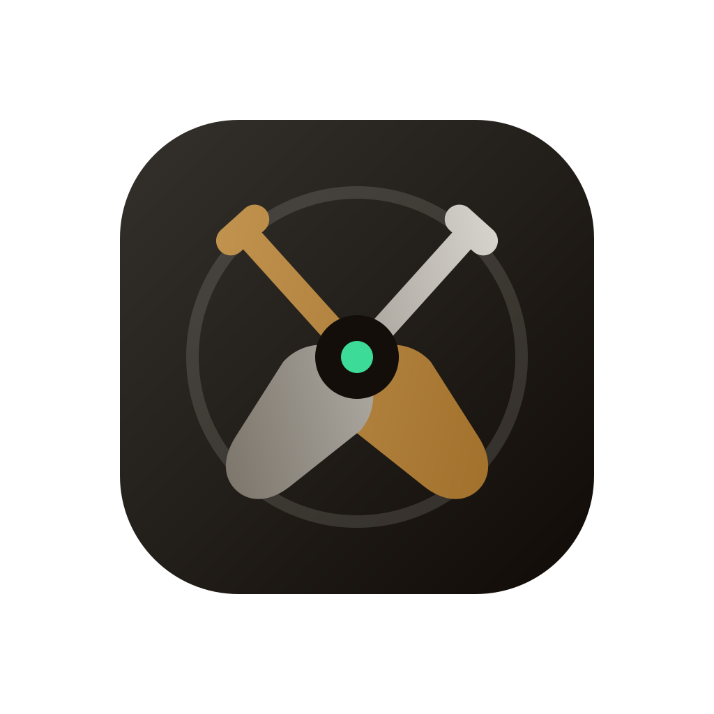

<p align="center">
  <a href="https://getoars.app">
    
  </a>
</p>

<h1 align="center">Oars</h1>

<p align="center">
  Operate every Linux server from one local window.<br>
  Open source server management for macOS and Linux, built around SSH.
</p>

<p align="center">
  <a href="https://getoars.app">Website</a> ·
  <a href="#download">Download</a> ·
  <a href="#get-started">Get started</a> ·
  <a href="#local-development">Development</a> ·
  <a href="https://github.com/onyedikachi-david/oars/issues">Issues</a> ·
  <a href="https://github.com/sponsors/onyedikachi-david">Sponsor</a>
</p>

<p align="center">
  <a href="https://github.com/onyedikachi-david/oars/actions/workflows/ci.yml">
    
  </a>
  <a href="LICENSE">
    
  </a>
</p>

<p align="center">
  <a href="https://www.producthunt.com/products/oars?embed=true&amp;utm_source=badge-featured&amp;utm_medium=badge&amp;utm_campaign=badge-oars" target="_blank" rel="noopener noreferrer"></a>
  <a href="https://smollaunchpad.com/projects/oars?utm_source=badge" target="_blank" rel="noopener noreferrer"></a>
</p>

<a href="https://getoars.app">
  
</a>

Oars brings terminals, files, logs, monitoring, deployments, backups, and remote desktops into one desktop app. Connect to your Linux servers over SSH, keep connection credentials in your OS credential store, and move between daily tasks without leaving your workspace.

Use it to investigate a slow server, move files, deploy an application, run scripts across your fleet, or open a remote desktop when you need a graphical interface.

## Why Oars

- **One workspace for your fleet.** Save server profiles, organize groups, and keep up to 16 server views open, with up to four panes per scroll section.
- **Start with SSH.** Connect with a password, private key, or SSH agent, including through a jump host. Review host fingerprints before trusting a new server.
- **See what is happening.** Inspect CPU, memory, disks, and processes, then search or follow logs without installing a monitoring agent.
- **Work with files and terminals.** Open interactive shells and browse, transfer, edit, and manage remote files over SFTP.
- **Run repeatable operations.** Save scripts, run them across servers, review deployment plans, and schedule rclone-backed backups.
- **Manage server access.** Work with SSH keys, authorized users, key rotation, and onboarding or offboarding from the same workspace.
- **Open a remote desktop.** Connect to VNC through an SSH tunnel, with clipboard controls, scaling, and full-screen mode.
- **Bring your own AI provider.** Ask about server context and review proposed commands before execution.
- **Keep a local record.** Search command history and audit events, review outcomes, and export your configuration.

## Download

[**Download for macOS**](https://github.com/onyedikachi-david/oars/releases/latest/download/oars-macos.zip) · [**Download for Linux (x86_64)**](https://github.com/onyedikachi-david/oars/releases/latest/download/oars-linux-x86_64.tar.gz)

These links download the latest release files directly. Public release downloads do not require a GitHub account. See [release notes and checksums](https://github.com/onyedikachi-david/oars/releases) for more details.

## Get started

1. Choose your operating system from the [download links above](#download), or [build from source](#local-development).
2. Open Oars and select **Add server**. Enter the host, SSH user, and authentication method.
3. Check the server's host fingerprint against a trusted source, then connect.
4. Open **Monitor**, **Terminal**, **Logs**, or **Files**, or choose another tool from the server's menu.

Oars runs on macOS and Linux and connects to Linux servers. Windows is not currently supported. Some tools need software on the remote server, such as rclone for backups or a VNC server and desktop environment for remote desktop access.

macOS packages are currently unsigned and not notarized. If macOS blocks a download you trust, follow [Apple's instructions for opening an unidentified app](https://support.apple.com/guide/mac-help/mh40616/mac).

For newer builds, successful [CI runs](https://github.com/onyedikachi-david/oars/actions/workflows/ci.yml) provide `oars-macos` and `oars-linux` artifacts. These are release-optimized builds; downloading workflow artifacts requires a GitHub account.

## In pictures

<details>
<summary><strong>Remote desktop</strong> — a Linux desktop inside your SSH workspace</summary>


</details>

<details>
<summary><strong>Logs</strong> — discover sources, search output, and follow changes</summary>


</details>

<details>
<summary><strong>AI assistance</strong> — server conversations and reviewed commands</summary>


</details>

<details>
<summary><strong>Deployments</strong> — prepare an application for deployment</summary>


</details>

<details>
<summary><strong>History</strong> — commands, results, and audit events</summary>


</details>

<details>
<summary><strong>Full screen</strong> — more room for your remote desktop</summary>


</details>

## Your data

Server profiles, settings, command history, and audit records are stored on your device. Connection passwords and provider credentials use the OS credential store. Configuration exports exclude stored credentials and can be encrypted with a password.

AI features send the context you choose to the provider you configure. Review that context before sending it. History redaction is best effort: unknown secrets can remain in command text or output. Interactive shell history capture is optional and requires shell integration.

## Local development

Oars uses a Zig core, a React and TypeScript frontend, and the [Native SDK](https://github.com/native-sdk/native-sdk) desktop WebView. SSH and cryptography use vendored libssh2 and mbedTLS sources.

### Requirements

- Zig **0.16**.
- Node.js **24** and npm.
- Native SDK CLI **0.7.1**.
- **macOS:** Xcode Command Line Tools (`xcode-select --install`).
- **Linux:** GTK4 and WebKitGTK 6.0 development packages. On Ubuntu, run `sudo apt install pkg-config libgtk-4-dev libwebkitgtk-6.0-dev`.

### Run locally

```sh
git clone https://github.com/onyedikachi-david/oars.git
cd oars

npm install --global @native-sdk/cli@0.7.1
export NATIVE_SDK_PATH="$(npm root --global)/@native-sdk/cli"

npm ci --prefix frontend
zig build dev
```

This starts the Vite development server and the native desktop shell. You can also point `NATIVE_SDK_PATH` at a local SDK checkout or pass `-Dnative-sdk-path=/path/to/native-sdk`.

### Common commands

| Command | Purpose |
| --- | --- |
| `zig build dev` | Run the frontend dev server and native shell |
| `zig build run` | Run the native shell with the built frontend |
| `zig build test` | Run the Zig tests |
| `npm --prefix frontend run typecheck` | Check frontend types |
| `npm --prefix frontend test` | Run the frontend tests |
| `zig build package -Dpackage-target=macos` | Build a macOS release package on macOS |
| `zig build package -Dpackage-target=linux` | Build a Linux release package on Linux |
| `native doctor --manifest app.zon` | Check desktop SDK and platform prerequisites |

Packages are written to `zig-out/package/`. Run each package command on its matching operating system; the target option does not provide the other platform's WebView dependencies.

<details>
<summary><strong>Build options and diagnostics</strong></summary>

Common build options (see `build.zig`):

```sh
zig build run -Dplatform=macos -Dweb-engine=chromium
zig build run -Dplatform=macos -Dweb-engine=chromium -Dcef-auto-install=true
zig build run -Dnative-sdk-path=/path/to/native-sdk
native doctor --web-engine chromium
```

Diagnostics:

```sh
NATIVE_SDK_LOG_DIR=/tmp/oars-logs NATIVE_SDK_LOG_FORMAT=jsonl zig build run
```

</details>

<details>
<summary><strong>Project layout and architecture</strong></summary>

| Path | Contents |
| --- | --- |
| `src/` | Zig core, SSH sessions, storage, and native bridge |
| `frontend/` | React interface, terminal, and feature tabs |
| `website/` | Product website and redacted screenshots |
| `third_party/` | Vendored libssh2 and mbedTLS sources |
| `scripts/` | Development helpers and integration test fixtures |
| `app.zon` | Application identity, permissions, and window configuration |
| `build.zig` | Native build, frontend steps, and packaging |

- **One worker thread per SSH session** owns every `libssh2` call (the library is not thread-safe). The main thread never blocks on the network.
- **Bridge RPC** (`oars.*` in `src/bridge.zig`) is `invoke/response` only — no native-to-JS push. The frontend polls `oars.ssh.poll` (and feature-specific `poll` endpoints) with per-channel cursor deltas (`cursor`, `dropped`, `rewind`, 4 MB cap).
- **Streaming reuse** — logs tail, deploy output, broadcast, and backup progress all reuse the same cursor-delta protocol.
- **Persistence** — local JSON/JSONL stores (`servers.json`, `history.jsonl`, `audit.jsonl`, …) written atomically via `temp+rename` with `0600` file permissions; corrupt files are quarantined, not silently discarded.
- **WebView origins** — `zero://app` (packaged) and `zero://inline` plus `http://127.0.0.1:5173` in dev; external navigation is denied. VNC's WebSocket upgrade validates the packaged origin and the `Sec-WebSocket-Key` handshake.

</details>

<details>
<summary><strong>Release process</strong></summary>

Release Please reads Conventional Commits on `main` and automatically maintains a release pull request containing the next SemVer version and a detailed `CHANGELOG.md`. Merge that release PR when it is ready. The same workflow then creates the `vX.Y.Z` tag and GitHub Release, builds both desktop packages, and attaches the macOS ZIP, Linux tarball, and SHA-256 checksums. Do not create release tags manually.

The application version is synchronized through `version.txt`, `app.zon`, and `build.zig`. Repository settings must allow the release bot to write and open pull requests: **Settings → Actions → General → Workflow permissions → Read and write permissions**, then enable **Allow GitHub Actions to create and approve pull requests**.

Use Conventional Commit prefixes so the version and changelog category are calculated correctly: `feat:` for a minor release, `fix:` for a patch, and `feat!:`/`fix!:` or a `BREAKING CHANGE:` footer for a major release.

</details>

## Contributing

Bug reports and pull requests are welcome. For a bug, include your operating system, Oars version, reproduction steps, and relevant logs with credentials and private server details removed.

For code changes, explain the problem and the resulting behavior, and run the checks relevant to your change. Use Conventional Commit titles such as `fix:` or `feat:` so releases can generate the changelog.

## Support Oars

If Oars helps you manage your servers, consider [sponsoring its development on GitHub](https://github.com/sponsors/onyedikachi-david). Your support helps fund maintenance and continued development.

You can also help by [starring Oars on GitHub](https://github.com/onyedikachi-david/oars), reporting bugs, contributing fixes, or sharing it with other developers.

## License

Oars is licensed under the [MIT License](LICENSE). Vendored dependencies retain their own licenses.
