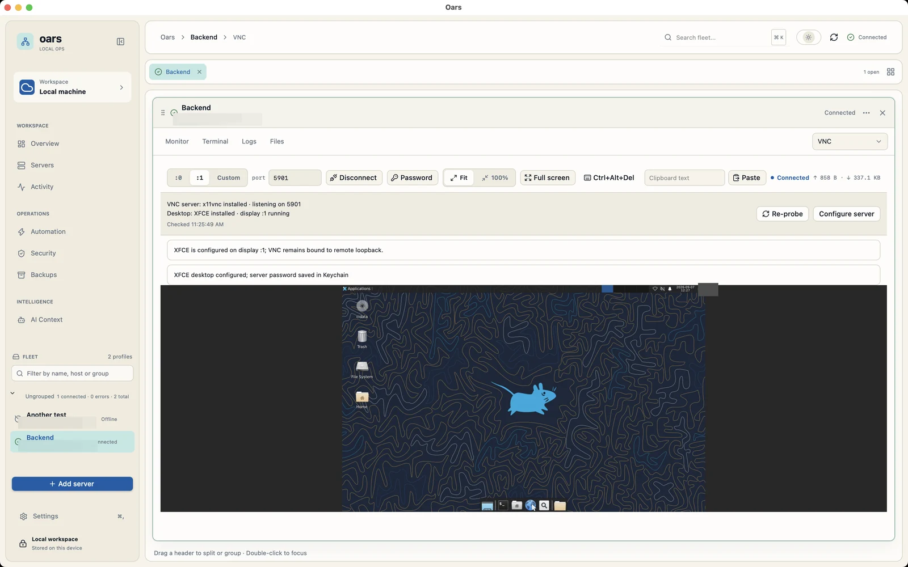
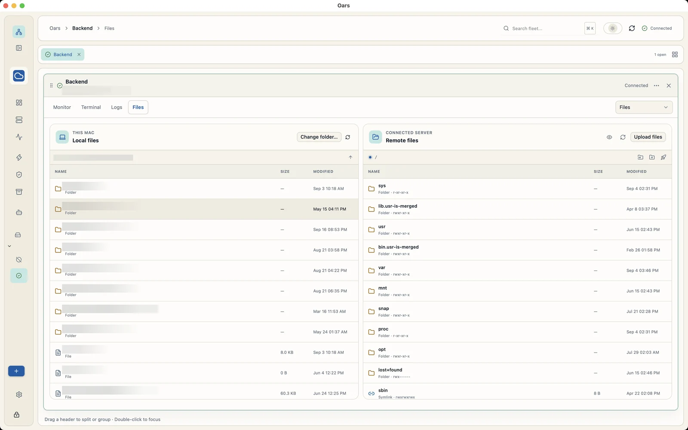
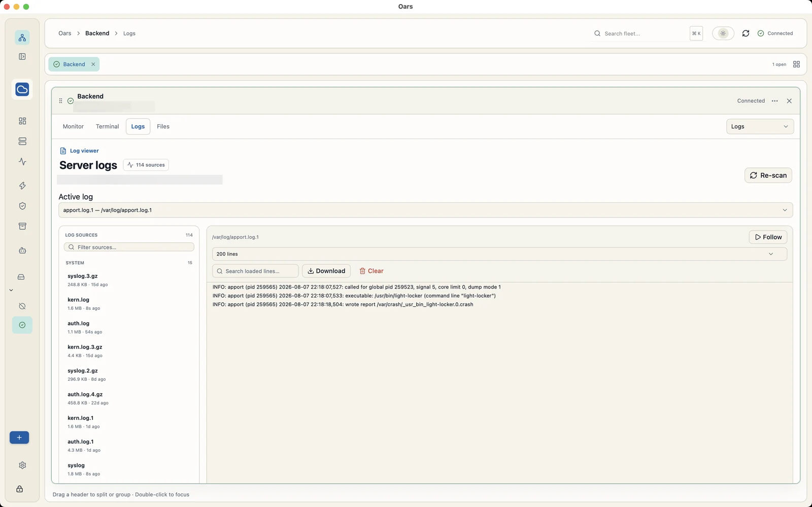
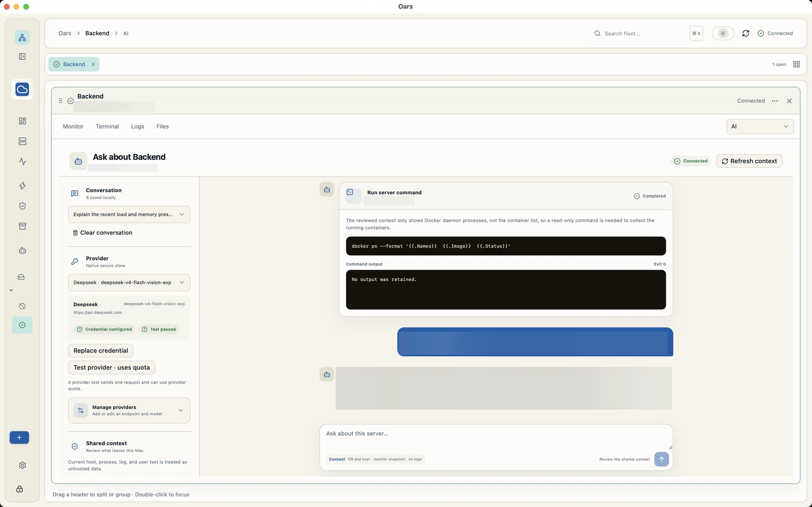
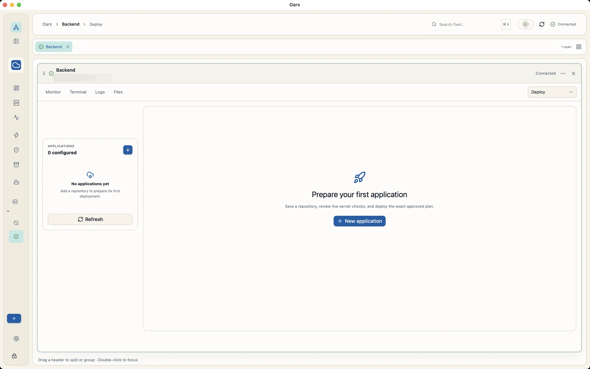
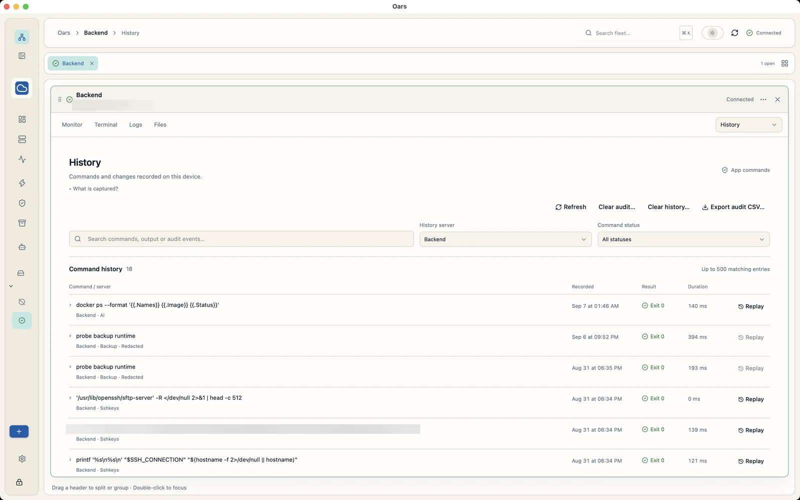
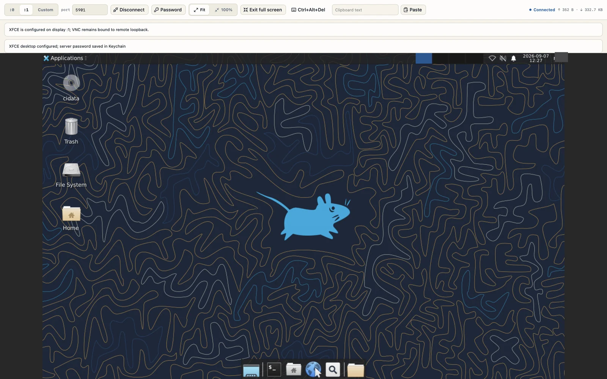

# Oars

Local-first Linux server management desktop app. Manage servers over SSH from a native desktop window — terminals, files, logs, monitoring, scripts, deployments, backups, and remote desktop — with local credential storage.

Built with a Zig core and a React frontend, shelled by the [Native SDK](https://github.com/native-sdk/native-sdk) WebView.

## Screenshots

Real captures from the desktop app. Private connection details, file names, and
infrastructure information have been redacted.



<details>
<summary>Explore files, logs, AI assistance, deployments, history, and full screen</summary>

### Files


### Logs


### AI assistance


### Deployments


### History


### Full-screen desktop


</details>

## Features

- **Server fleet** — save connection profiles (host, port, user, auth) and open each server in its own tab.
- **SSH terminal** — interactive PTY shell (xterm.js) with resize, scrollback, and concurrent exec channels.
- **Host-key verification** — `SHA256:` fingerprints, first-connect trust dialog, and mismatch detection.
- **Auth methods** — password, private key file (including Ed25519), and SSH agent (`SSH_AUTH_SOCK`) with optional jump-host chaining.
- **Monitoring** — agentless CPU, memory, disk, load and process gauges via remote probes.
- **Logs** — discover, read, tail, search, download, and truncate remote log files.
- **File manager** — browse, upload, download, edit, rename, chmod, and archive files over SFTP.
- **Scripts** — saved shell scripts with single-server and broadcast (multi-server) execution.
- **Deployments** — app definitions with git-based deploys, run history, and streaming output.
- **SSH keys** — `authorized_keys` management, key generation, rotation, and deploy keys / roles.
- **Access management** — identities, onboarding/offboarding, rotation, and export.
- **Backups** — rclone-backed backup jobs, test, run, history, and cron scheduling.
- **AI terminal** — provider-configured assistant with context-aware execution (approval-gated).
- **Remote desktop (VNC)** — tunneled VNC session via WebSocket/noVNC.
- **History & audit** — bounded local journals of commands and mutating actions with redaction.
- **Vault** — encrypted (`AES-256-GCM`/`PBKDF2`) and plain-JSON export/import of configuration.

## Tech Stack

| Layer | Details |
|---|---|
| Core | Zig 0.16, hermetic build — no system dependencies |
| SSH / Crypto | Vendored `libssh2 1.11.1` + `mbedTLS 3.6.2` compiled via `zig cc` (`third_party/`) |
| Desktop shell | Native SDK WebView (`app.zon` / `build.zig`) |
| Frontend | React 19 + TypeScript + Vite 8, `xterm 5.3` + `xterm-addon-fit`, `@novnc/novnc 1.7`, Tailwind CSS 4 |
| Platforms | macOS and Linux (Windows packaging plumbing exists, but the app core is not yet Windows-compatible) |

## Project Structure

```
.
├── app.zon            # Native SDK manifest (app id, permissions, frontend, window)
├── build.zig          # Hermetic build: vendored C libs, SDK wiring, frontend steps
├── build.zig.zon      # Zig package manifest
├── src/               # Zig core (~33 modules)
│   ├── main.zig       # App wiring + store initialization
│   ├── bridge.zig     # oars.* RPC dispatcher (origin + permission gated)
│   ├── sessions.zig   # Per-server worker threads (own all libssh2 calls)
│   ├── ssh.zig        # Transport, channels, exec, PTY
│   ├── openssh.zig    # OpenSSH private-key parsing + AES-CTR decrypt
│   ├── sftp.zig       # SFTP file operations
│   ├── monitor.zig    # Probe parsing (CPU deltas, mem/disk/processes)
│   ├── logs.zig       # Log discovery + follow
│   ├── scripts.zig / broadcast.zig / deploy.zig
│   ├── access.zig / sshkeys.zig / keygen.zig
│   ├── backup.zig / vault.zig / crypto.zig
│   ├── vnc.zig / ws.zig / ai.zig
│   ├── history.zig    # Bounded JSONL journals
│   ├── shellquote.zig # Single shared POSIX quoting for all exec strings
│   └── runner.zig     # Platform run loop
├── frontend/
│   ├── src/           # React app: App.tsx, TerminalTab, FilesTab, MonitorTab, etc.
│   └── package.json
├── third_party/
│   ├── libssh2/       # Vendored, built from source
│   └── mbedtls/       # Vendored, built from source
├── scripts/           # Dev helpers (e.g. dockerized sshd for integration tests)
└── website/           # Product website and sanitized screenshots
```

## Prerequisites

- **Zig 0.16**
- **Node.js 24** and **npm** (frontend)
- **Native SDK CLI 0.7.1** (`native`) — set `NATIVE_SDK_PATH` as below, or pass `-Dnative-sdk-path=…`. A local `native-sdk/` checkout is also supported.
- **macOS:** Xcode Command Line Tools (`xcode-select --install`) for the WebView/ObjC hosts
- **Linux:** GTK4 and WebKitGTK 6.0 development packages (for Ubuntu: `sudo apt install pkg-config libgtk-4-dev libwebkitgtk-6.0-dev`)

## Quick Start

```sh
# Install the desktop SDK and point the build at it.
npm install --global @native-sdk/cli@0.7.1
export NATIVE_SDK_PATH="$(npm root --global)/@native-sdk/cli"

# install frontend deps (also runs automatically via zig build)
npm install --prefix frontend

# run with live frontend (Vite dev server + native shell)
zig build dev

# run the built frontend inside the native shell
zig build run

# tests
zig build test

# macOS production package (run on macOS)
zig build package -Dpackage-target=macos

# Linux production package (run on Linux)
zig build package -Dpackage-target=linux
# → zig-out/package/oars-<version>-<target>-ReleaseFast[.app]

# sanity check for the manifest / SDK setup
native doctor --manifest app.zon
```

`zig build dev` starts the Vite dev server from `app.zon` (`http://127.0.0.1:5173`) and launches the shell with `NATIVE_SDK_FRONTEND_URL` once the dev server is ready. Frontend production assets are emitted to `frontend/dist`.

Run each package command on its matching operating system. `-Dpackage-target` selects the package layout; it does not install or cross-compile the platform WebView dependencies. The GitHub Actions workflow in `.github/workflows/ci.yml` builds both supported targets on native runners and publishes them as workflow artifacts.

## Downloads and releases

Oars uses the application ID `app.getoars`. The runtime
reads it from `app.zon`, which also supplies the package metadata. Server data
continues to use the `Oars` data directory. The legacy Keychain service name is
retained for compatibility with existing saved credentials. macOS window and
WebView preferences may start fresh after the bundle ID change.

macOS downloads are currently not Developer ID-signed or notarized. A paid Apple
Developer Program membership is not required to build Oars or publish its ZIP.
Users who trust the download can follow
[Apple's instructions for opening an unidentified app](https://support.apple.com/guide/mac-help/mh40616/mac),
using **System Settings → Privacy & Security → Open Anyway** when offered.


Every successful CI run exposes temporary `oars-macos` and `oars-linux` downloads in the **Artifacts** section of that Actions run. GitHub's **Packages** panel is for package registries and is not used for Oars desktop binaries.

Release Please reads Conventional Commits on `main` and automatically maintains a release pull request containing the next SemVer version and a detailed `CHANGELOG.md`. Merge that release PR when it is ready. The same workflow then creates the `vX.Y.Z` tag and GitHub Release, builds both desktop packages, and attaches the macOS ZIP, Linux tarball, and SHA-256 checksums. Do not create release tags manually.

The application version is synchronized through `version.txt`, `app.zon`, and `build.zig`. Repository settings must allow the release bot to write and open pull requests: **Settings → Actions → General → Workflow permissions → Read and write permissions**, then enable **Allow GitHub Actions to create and approve pull requests**.

Use Conventional Commit prefixes so the version and changelog category are calculated correctly: `feat:` for a minor release, `fix:` for a patch, and `feat!:`/`fix!:` or a `BREAKING CHANGE:` footer for a major release.

## Commands

| Command | What it does |
|---|---|
| `zig build dev` | Vite dev server + native shell (fast edit loop) |
| `zig build run` | Native shell with built frontend |
| `zig build test` | Zig test suite (`std.testing.allocator` leak checks) |
| `zig build package -Dpackage-target=<macos\|linux>` | Release-optimized package for the current host OS under `zig-out/package/` |
| `zig build frontend-install` | Explicit `npm install --prefix frontend` |
| `zig build frontend-build` | Explicit `npm run build` for the frontend |
| `native doctor --manifest app.zon` | Validate manifest / platform prerequisites |
| `native cef install` | Fetch CEF runtime for Chromium WebView (macOS) |

Common build options (see `build.zig`):

```sh
zig build run -Dplatform=macos -Dweb-engine=chromium
zig build run -Dplatform=macos -Dweb-engine=chromium -Dcef-auto-install=true
zig build run -Dnative-sdk-path=/path/to/native-sdk
native doctor --web-engine chromium
```

Diagnostics:

```sh
NATIVE_SDK_LOG_DIR=/tmp/oars-logs NATIVE_SDK_LOG_FORMAT=jsonl zig build run
```

## Architecture

- **One worker thread per SSH session** owns every `libssh2` call (the library is not thread-safe). The main thread never blocks on the network.
- **Bridge RPC** (`oars.*` in `src/bridge.zig`) is `invoke/response` only — no native-to-JS push. The frontend polls `oars.ssh.poll` (and feature-specific `poll` endpoints) with per-channel cursor deltas (`cursor`, `dropped`, `rewind`, 4 MB cap).
- **Streaming reuse** — logs tail, deploy output, broadcast, and backup progress all reuse the same cursor-delta protocol.
- **Persistence** — local JSON/JSONL stores (`servers.json`, `history.jsonl`, `audit.jsonl`, …) written atomically via `temp+rename` with `0600` file permissions; corrupt files are quarantined, not silently discarded.
- **WebView origins** — `zero://app` (packaged) and `zero://inline` plus `http://127.0.0.1:5173` in dev; external navigation is denied. VNC's WebSocket upgrade validates the packaged origin and the `Sec-WebSocket-Key` handshake.

## Security

- Secrets (passwords, key passphrases, VNC/AI/backup credentials) are stored in the OS Keychain via `native-sdk.credentials.*` and never written to config files. Export deliberately excludes secrets; import re-prompts on first connect.
- Every `oars.*` command is origin-gated and, where it touches credentials or dialogs, permission-gated. Dialog and credential policies are declared in both `app.zon` and `src/main.zig`.
- All values interpolated into remote shell commands go through a single POSIX single-quote routine (`src/shellquote.zig`); file operations that can avoid the shell use SFTP instead.
- Mutating server actions are approval-gated; destructive operations require explicit confirmation. Executed commands are recorded in the local history/audit journals.

## Frontend Development

```sh
npm --prefix frontend run dev      # Vite dev server alone
npm --prefix frontend run build    # production build → frontend/dist
```

Frontend routing and tab state live in `frontend/src/App.tsx`; per-feature tabs are `*Tab.tsx` files; the bridge client is `frontend/src/bridge.ts` with shared types in `frontend/src/types.ts`.

## License

MIT — see [LICENSE](LICENSE).
