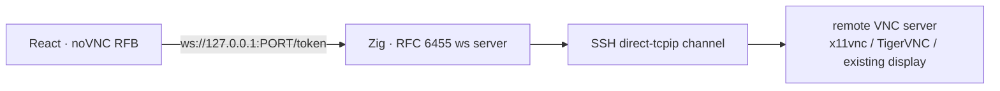
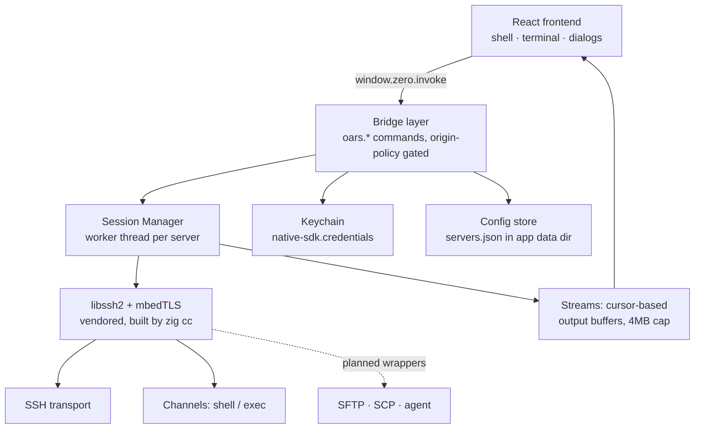

# Oars — Implementation Plan

> **One window for every server you run.** An open-source, local-first server
> management console — inspired by tools like CtrlOps, built to outdo them on
> UI, UX, and feature depth, and free, with your keys staying on your machine.

- **Core stack:** Zig 0.16 native core (Native SDK shell) + React/TypeScript frontend in a WebView
- **SSH stack:** vendored libssh2 + mbedTLS, built hermetic by `build.zig` (no system deps)
- **Credentials:** secrets are stored in the OS credential store. A secret
  leaves local memory only when the user asks Oars to send it to its intended
  service, such as an SSH server, AI provider, or backup destination. Oars has
  no credential-sync service.
- **License (planned):** Apache-2.0 (matches Native SDK + mbedTLS; libssh2 is BSD-3)

---

## 1. CtrlOps public-product snapshot (verified 2026-08-03)

This section records the dated vendor-published parity baseline that Oars must
cover. It is not a test of CtrlOps internals. Later vendor changes can add new
research work, but they do not silently remove an Oars feature already selected
here. CtrlOps public docs report v1.1.0, and its July 18 changelog added multi-tab workspaces, a
deployments tab, direct GitHub connection, a logs tab, built-in AI providers,
terminal suggestions, and a vault lock. Recheck the
[current docs](https://ctrlops.io/docs) and
[changelog](https://ctrlops.io/changelog) before using this list in a product
decision.

### 1.1 Multi-Server Management
- Fleet saved by alias/name, find server by name, per-server tabs
- Connection state + latency visible per connection
- Unlimited servers; one click to connect; independent tab per server

### 1.2 Terminal (SSH)
- Full interactive terminal per server (xterm-class)
- Host-key trust flow (fingerprint verification on first connect)

### 1.3 Real-Time Infra Monitoring
- Gauges: CPU (load %, uptime, core count), RAM (used/total, available, swap), disk (used/total, available)
- Top 10 processes, sortable by CPU% / Mem%
- Auto-refresh every 2s; agentless (reads `top`/`free -h`/`df -h`/`ps aux --sort=-%cpu`)
- Gauge threshold bands: 0–60 green, 60–80 yellow, 80–90 orange, 90+ red
- Cleanup examples appear in the vendor UI. Oars keeps the cache-drop feature
  under Advanced diagnostics with the kernel warning, privilege approval, and
  audit record; it is not presented as routine memory cleanup. See spec 03.
- "Hand PID to AI terminal" flow

### 1.4 Log Management
- Auto-scan server → list log files, grouped (Web Servers: nginx; Runtime & Apps: PM2)
- Each source stamped with size + time since last write ("which log moved recently")
- Viewer: last 200 lines default, 500/1,000/5,000 options; search within loaded lines
- **Follow** = live tail (GUI `tail -f`); **Download** whole file; **Clear** (truncate) with confirm
- Manual path add (saved across visits); read-permission failures surface honestly
- Explicitly one server at a time — no fleet aggregation, no retention, no archives

### 1.5 Visual File Manager
- Filesystem browser (default tab after connect); hidden-items toggle (dotfiles)
- Drag-drop upload/download, per-file progress, cancel; Upload Dir (whole folder)
- Built-in text editor: open `.env`/`nginx.conf` on the server, Save writes back
- **Expand ZIP** in place (unzip into folder named after the zip)
- Multi-select → **Download as .zip** (compress first)
- Copy Path / Open in Terminal → AI terminal bridge
- Five views: grid, list, compact, columns, gallery
- Folder sizes computed on demand (`du -sh * | sort -rh`)
- Add Application → deploy form entry point

### 1.6 Script Directory
- Saved commands with `{{variable}}` placeholders (detected while typing), name/description/tags
- Run on the currently-open server; variable prompt at run time
- Color-coded cards (destructive scripts visually distinct), run-count per script, search + tag filter
- Library lives in the app data folder — available on every connection, nothing installed on servers
- No scheduling is described. The reviewed script page shows running a saved
  script on the active server, but other vendor marketing uses multi-server
  language. The sources do not establish whether fan-out exists, so Oars does
  not use its absence as a competitor claim.

### 1.7 One-Click Deployment
- Form: app name, environment (dev/staging/prod), folder `/home/<user>/<name>`, repo (HTTPS public / SSH private + branch)
- Node.js version picker (installs missing versions during deploy)
- App types: Node.js, React, Next.js, static build folder — install/build/start commands auto-filled from framework, editable (yarn/pnpm)
- Environment variables: individual add + **bulk .env paste** (comments ignored, quotes survive)
- Domains + SSL toggle (certbot, auto-covers `www.`); DNS prerequisite noted
- **Six visible steps in a live terminal:** clone → install deps → build → PM2 → nginx config → certbot
- Per-step output; failing step's output can be handed to the AI terminal
- Public docs currently describe Node.js, React, Next.js, and static builds.
  The current deployment guide also says there is no built-in re-deploy button
  and recommends a saved script instead. This is a dated vendor claim, not a
  reason to remove Oars re-deploy.

### 1.8 SSH Management (per-server)
- Key registry for one box: every key in `authorized_keys`, one-click revoke
- Custom roles: **read-only and read-write system users** (created without touching visudo)
- SSH config management per server (no `~/.ssh/config` editing), key generation, deploy-key copy for GitHub

### 1.9 Access Management (fleet)
- Fleet scan → people map: person × servers reachable × servers with sudo (shield badge)
- Drill into a person → exact logins per server
- **Offboard from all servers in one confirmed action** (type-to-confirm)
- **Onboard** one key to many servers, role per server (root / standard / read-only)
- **Key rotation** across every server in one action
- **Audit export** (person / server / sudo table) for security questionnaires
- Read-only scan; unreachable servers flagged (Sync Error), never silently clean; snapshot semantics + re-scan

### 1.10 Backup
- Job form: name, source path, destination type (S3-compatible), transfer type **Sync / Copy**
- Providers: AWS S3, Cloudflare R2, Backblaze B2, Wasabi, MinIO, DigitalOcean Spaces (+ custom endpoint)
- Storage class: Standard / Glacier / Deep Archive
- Credentials: access/secret key (encrypted) **or IAM role** (nothing stored)
- Schedule: manual / interval / custom cron — **writes the crontab for you**; server-timezone notice
- **Test Connection before save**; one-click install of rclone + cron service when missing
- Live progress: size transferred, files transferred, speed, ETA, elapsed; per-run **View Log**
- The current detailed [backup module](https://ctrlops.io/docs/modules/backup)
  says the shipped destination is S3-compatible storage: AWS S3, Cloudflare
  R2, Backblaze B2, Wasabi, MinIO, and DigitalOcean Spaces. It says more
  destinations are future work. The docs home page still says Dropbox and
  "any cloud provider," so this snapshot uses the specific module contract
  instead of that broader summary.

### 1.11 AI Terminal
- Plain-English → exact command + explanation → **approval card (Run / Edit / Cancel)**
- Destructive operations are flagged before approval; every command enters
  history and every mutating action gets a separate audit record
- Models: OpenAI, Claude, Gemini, any OpenAI-compatible endpoint — BYO key, AES-256 local, no markup
- **Live web search** toggle (Tavily, Brave, DuckDuckGo), sources as inline chips
- **MCP servers**: Context7, GitHub, Filesystem built in; add your own by pasting JSON; tool badges
- Approved commands can be saved as scripts; full SSH terminal remains available

### 1.12 Remote Desktop (VNC) — Oars researched design

No VNC or remote-desktop module was listed in the CtrlOps public docs or
changelog reviewed on 2026-08-03. This is an absence-of-evidence statement,
not proof about private or future builds.
MobaXterm and Royal TS have VNC but as separate clients with their own auth stores. Oars gets
it as a first-class per-server tab, agentless, tunneled over the SSH session we already own.

**Research findings (verified 2026-08-03):**

- **Client: `@novnc/novnc` 1.7.0** — MPL-2.0, zero dependencies, ESM (`exports: ./core/rfb.js`),
  maintained by Cendio (the TigerVNC team). Works in any WebView with WebSocket + canvas.
  API: `new RFB(target, url, {credentials})`, `rfb.sendCredentials(...)`, events
  `connect/disconnect/credentialsrequired/securityfailure/desktopname/clipboard`,
  public controls `disconnect()/sendCredentials()/sendCtrlAltDel()/clipboardPasteFrom()`
  plus `scaleViewport` and `resizeSession` properties. Construction starts the
  connection; there is no public `connect()` or `setScale()` method.
  VNC password auth (DES challenge) is handled by noVNC — we just supply the password from
  the Keychain (account `vnc:<server_id>`), same pattern as SSH.
- **Tunnel primitive: `libssh2_channel_direct_tcpip_ex(session, host, port, shost, sport)`**
  — confirmed in the vendored 1.11.1 header. Opens a direct-tcpip channel: the remote server
  connects to `host:port` and the channel is our byte pipe to it. (Also available:
  `direct_streamlocal_ex` for remote Unix-socket tunnels. SSH-agent forwarding
  uses an auth-agent channel request and callback proxy; see spec 18.)
- **Transport: noVNC speaks WebSocket, VNC is raw TCP** → we need a local WebSocket bridge.
  No external websockify: the Zig core implements a bounded RFC 6455 server
  with an upgrade handshake and a masked-frame codec, then bridges it to the
  SSH channel. Frame encode/decode round-trips are headless-testable in
  `zig build test`.
- **WebView policy check:** direct packaged-app measurement on 2026-08-03 found
  `location.href = zero://app/index.html`, `location.origin = zero://app`, and
  `isSecureContext = true`; the WebSocket upgrade sent `Origin: zero://app`.
  A second packaged run proved that
  `connect-src 'self' ws://127.0.0.1:*` permits the required loopback
  connection. The production bridge therefore allows `zero://app`; development
  allows the configured `http://127.0.0.1:5173` origin. noVNC offered the
  `binary` subprotocol and `permessage-deflate`; the bridge selects `binary`
  and declines extensions because its codec does not implement compression.

**Architecture:**

- `oars.vnc.start {server_id, host, port}` — session worker opens the direct-tcpip channel
  and a 127.0.0.1 listener on an ephemeral port; returns `{port, token}`.
- Worker loop extension: per-tunnel bridge (accept → ws handshake → frame in/out ↔ channel
  bytes). One channel per tunnel; same worker-thread ownership rules as everything else.
- **Security:** bind 127.0.0.1 only; validate the WebSocket `Origin` header against our
  measured origins; use a per-tunnel random token in the URL path; auto-destroy
  the tunnel if no WebSocket connection arrives within 15s. SSH encrypts the
  client-to-server transport, but the short remote loopback hop to the VNC
  service is plaintext.
- **Oars+ one-click setup helper (approval-gated):** `oars.vnc.probe` checks for x11vnc /
  TigerVNC and listening 59xx ports; if missing, suggests an install+start command presented
  in an approval card (same pattern as the AI terminal) — we never mutate the server
  without a click.
- **Bonus reuse:** the same direct-tcpip machinery is exactly what their *planned* Database
  Manager needs (Postgres/MySQL over SSH tunnels) — building VNC builds the tunnel
  foundation for that too.

### 1.13 Current public status

- **Verified shipped in the changelog:** multi-tab workspace, deployments tab,
  direct GitHub connection, logs tab, built-in AI providers, terminal
  auto-suggestions, vault lock, fleet access management, custom roles, MCP,
  web search, script management, file transfers, and session recovery.
- **Still described as roadmap in current public comparison pages:** database
  management GUI, mobile apps, and push alerting. These are time-sensitive
  vendor claims and must be rechecked.
- The previous detailed "planned / in progress / shipped" list mixed pages from
  different dates and called already shipped work pending. It was replaced by
  this dated source snapshot.

---

## 2. Where Oars goes further

Every CtrlOps pillar above is our baseline. These are the deliberate differentiators:

1. **Safe broadcast.** Run a script across a selection of servers with a
   per-server expansion preview and a single confirm. Current public CtrlOps
   docs do not establish the earlier claim that it explicitly refuses fan-out.
2. **Command palette (`⌘K`)** — fuzzy-search servers, scripts, actions, and history across the whole app; keyboard-first everywhere (they are form-and-mouse heavy).
3. **Server groups & fleet views** — folders/tags, status rollup per group, "all servers in group" monitoring grid.
4. **Command history with secret redaction** — per-server history, searchable, replayable; passwords/tokens masked in stored lines.
5. **SSH agent + jump hosts** — agent-socket auth and bastion hops (they track agent support as a display detail; we make it first-class).
6. **Process and alert controls.** PM2 actions and in-app threshold alerts reuse
   monitoring data, but both need privilege, failure, and load testing. Do not
   call them cheap or base sequencing on a stale competitor roadmap.
7. **Theme system.** Dark/light, accent choices, and terminal themes are
   Oars product decisions. Current CtrlOps docs do not establish a dark-only
   contract.
8. **Encrypted export** — server list + scripts + configs as an encrypted vault file (machine-to-machine moves); plus plain JSON without secrets.
9. **Multi-platform from day one** — same Zig core builds for macOS + Linux (SDK supports both); Windows later.
10. **Remote desktop (VNC) over SSH** — GUI console per server tab, tunneled
    through the session we already own; noVNC client, Zig RFC 6455 bridge, and
    Keychain-stored VNC passwords. This was not listed in the CtrlOps public
    material reviewed on 2026-08-03. The same tunnel machinery can later power
    database tunnels.

---

## 3. Architecture (built so far)

**Key design decisions and target constraints:**

1. **No native→JS push channel in the SDK** → frontend polls `oars.ssh.poll`
   (~80ms). The current stream advances one shared read cursor. The target API
   takes an absolute cursor per channel and per consumer, so mirrored views do
   not drain each other. Bounded-buffer overflow reports each reader's gap.
2. **The runtime main thread never blocks on the network.** One worker thread
   per connection owns its libssh2 session; cross-thread state is spin-locked,
   short critical sections.
3. **Host-key trust-on-first-use** (SHA-256 fingerprints in config); changed
   keys hard-fail with a clear message.
4. **Passwords/passphrases live in the Keychain** (keyed by server id); config
   files never contain secrets.
5. **Non-blocking everywhere + deadlines** — connect, handshake, auth run on
   poll loops with timeouts; a dead server can never hang the app.
6. **Hermetic build** — mbedTLS + libssh2 vendored, compiled with `zig cc` at
   ReleaseFast regardless of app mode. No Homebrew/system deps.

**Bridge surface (implemented):**

| Command | Purpose |
|---|---|
| `oars.servers.list` / `save` / `delete` | Fleet config CRUD (JSON store) |
| `oars.ssh.connect` / `disconnect` | Start/stop a session (secrets passed per-connect from Keychain) |
| `oars.ssh.poll` | Registered with a shared mutable cursor today; target is non-destructive per-channel deltas from caller-supplied cursors |
| `oars.ssh.input` | Terminal stdin |
| `oars.ssh.exec` | Fire-and-stream a command on a fresh channel (id returned) |
| `oars.ssh.resize` | Registered, but `resizePty` is currently a no-op; target sends PTY columns/rows |
| `oars.ssh.trust` | Accept/reject host-key fingerprint |
| `native-sdk.credentials.*` | Keychain (builtin, permission-gated) |
| `native-sdk.dialog.openFile` | Key picker (builtin, permission-gated) |

---

## 4. Roadmap

> Full per-feature contracts live in [`docs/specs/`](specs/README.md) —
> one spec per feature (bridge payloads, UI states, Zig design, security,
> edge cases, acceptance criteria). This section is the sequencing view.

### Stage 1 — Foundation partial
SSH transport, session manager, bridge protocol, terminal UI, trust flow, and
config store exist. Live key authentication, trust, and shell use were recorded
on 2026-08-03. Password auth and exec still need the container pass. PTY resize
is a no-op, full connect cancellation is not bounded, and server-store
permissions and corrupt-file recovery need hardening. LICENSE and CONTRIBUTING
are still absent.

### Stage 2 — Monitoring + Logs ✅ v1
- `oars.monitor.poll` — capability-selected reads of `/proc/stat`,
  `/proc/loadavg`, `/proc/meminfo`, `df`, and `ps`; parse in Zig and serve a
  cached snapshot on demand.
- Frontend: gauge strip with threshold bands (60/80/90), top-process table, 2s
  refresh, and sparkline history. Advanced diagnostics retains drop-caches with
  the kernel warning; disk cleanup uses itemized previews and confirmation.
- `oars.logs.*` — scan + group sources (size/last-write stamps), viewer with 200/500/1k/5k line counts, search-in-loaded-lines, follow, download, clear-with-confirm, manual path add.
- **Oars+ in this stage:** PM2 process controls and threshold alerts reuse the
  monitor pipeline. Their priority is an Oars product decision, not a claim
  about the vendor's current roadmap.

### Stage 3 — Remote Desktop (VNC) + port tunnels 🔨 next after Stage 2
- `src/ws.zig` — bounded RFC 6455 server: handshake with Origin validation,
  token path, explicit `binary` subprotocol selection, no extensions, frame
  and buffer limits, masked client frames, fragmentation, ping/pong, close,
  and unit tests.
- Worker-loop tunnel support: `oars.vnc.start/stop` (direct-tcpip channel + 127.0.0.1
  listener + bridge), idle-timeout, cleanup on disconnect.
- Frontend `VncTab`: noVNC RFB, display picker (`:0`, `:1`, custom port), credentials from
  Keychain (`vnc:<server_id>`), fit-window scaling, Ctrl+Alt+Del menu, clipboard, clear
  disconnect/security-failure states. One-click setup helper with approval card.
- **Reusable for:** DB tunnels (their planned Database Manager), SSH-agent forwarding,
  any local-port ↔ remote-service bridge.

### Stage 4 — File manager (SFTP)
- `oars.sftp.*` — session-scoped SFTP subsystem (worker-owned): ls/stat/read/write/mkdir/rm/rename/chmod/readdir.
- Frontend v1: one remote pane plus native file dialogs, hidden-items toggle,
  per-file progress and cancel, Finder/Explorer upload drops, inline editor,
  validated ZIP expansion, Download-as-zip, folder sizes on demand, and
  grid/list/compact views.

### Stage 5 — Scripts + Deployments
- `oars.scripts.*` — local script store: name/description/tags/color, `{{var}}` templating with run-time prompts, run on current server with output in a pane, run counts.
- **Oars safe broadcast:** select servers → expansion preview → confirm →
  bounded parallel streams.
- Deploy engine: app model (repo, branch, type, commands, env, domains) → 6-step runner (clone/install/build/pm2/nginx/certbot) with step state + per-step output, cancellable.

### Stage 6 — Access + Backups
- `oars.access.*` — fingerprint-keyed scan of effective authorized-key files,
  explicit complete/partial coverage, per-login sudo policy when authority
  permits it, selected-grant offboarding, multi-server onboarding, key
  rotation, and audit export. Per-server provisioning supports read-write
  standard users and forced read-only SFTP roles.
- `oars.backup.*` — job model (source, provider, bucket, keys/IAM, sync/copy, storage class, schedule) → rclone config + crontab written for you; test connection; live progress stats; per-run logs; install helpers.

### Stage 7 — AI terminal
- BYO key (Keychain), OpenAI-compatible endpoint; server context (OS, snapshot, log tail) + prompt → command + explanation → approval card with destructive-flag heuristic; edit → run → stream into session; every run logged to history; "save as script" shortcut. Web search + MCP later.

### Stage 8 — Polish, packaging, open source
- `⌘K` palette, groups, themes, keyboard shortcuts, empty states, error copy.
- Packaging (`zig build package`), CI (zig build test + frontend build on macOS/Linux), docs, LICENSE/README/CONTRIBUTING, first tagged release.

---

## 5. UX principles (the "far better" bar)

1. **Keyboard-first** — every action reachable from `⌘K`; terminal focus on tab open; `/` filters the server list.
2. **Status honesty** — one vocabulary: connecting = amber pulse, ready = blue, error = red. Never a spinner where state can be shown.
3. **Density over decoration** — monospace data, 13px base, tight rows; progressive disclosure instead of stacked panels.
4. **Approval-first for dangerous actions** — destructive flags, exact previews,
   verified dry runs where the underlying tool supports one, and
   type-to-confirm; every destructive command leaves a history entry.
5. **Performance as UX** — virtualized lists, canvas sparklines, poll deltas, smooth output under heavy `tail -f`.
6. **Local-first trust** — show "stored in Keychain" where secrets live; encrypted export; nothing phones home.

## 6. Risks & mitigations

| Risk | Mitigation |
|---|---|
| libssh2 channel multiplexing under concurrent exec+shell | One worker thread per session owns all channels; serialized reads in one loop |
| Poll latency vs interactive typing | 80ms poll ≈ local TTY feel; revisit with async bridge long-poll if needed |
| SFTP throughput via JSON bridge | 64KB chunk streaming, binary-safe escaping, per-poll budgets |
| Repo size (vendored mbedTLS ~5MB) | Acceptable; provenance + update procedure documented in `third_party/` |
| Debug/Release allocator differences (arena lifetimes) | Tests under `std.testing.allocator`; store owns buffers explicitly (`servers.zig Loaded`) |

## 7. Immediate next steps

1. Finish Stage 1 truth gaps: real PTY resize, cancellable DNS/TCP connect,
   owner-only server storage, and corrupt-file quarantine.
2. Run the dockerized sshd checks for password auth, key auth, trust, shell,
   exec exit codes, resize, disconnect during connect, and changed host keys.
3. Add LICENSE and CONTRIBUTING, then begin Stage 2 from the corrected specs.
