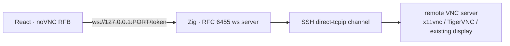
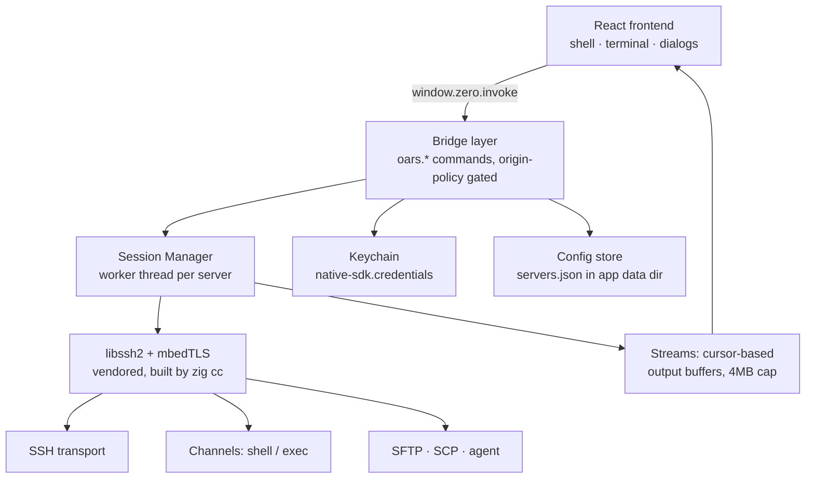

# Oars — Implementation Plan

> **One window for every server you run.** An open-source, local-first server
> management console — inspired by tools like CtrlOps, built to outdo them on
> UI, UX, and feature depth, and free, with your keys staying on your machine.

- **Core stack:** Zig 0.16 native core (Native SDK shell) + React/TypeScript frontend in a WebView
- **SSH stack:** vendored libssh2 + mbedTLS, built hermetic by `build.zig` (no system deps)
- **Credentials:** macOS Keychain via the SDK's credential bridge; nothing ever leaves the machine
- **License (planned):** Apache-2.0 (matches Native SDK + mbedTLS; libssh2 is BSD-3)

---

## 1. CtrlOps feature inventory (crawled from ctrlops.io, July 2026)

Full crawl of the 11 feature pages + roadmap + changelog. This is the
parity checklist — Oars must cover every row below.

### 1.1 Multi-Server Management
- Fleet saved by alias/name, find server by name, per-server tabs
- Connection state + latency visible per connection
- Unlimited servers; one click to connect; independent tab per server

### 1.2 Terminal (SSH)
- Full interactive terminal per server (xterm-class)
- Host-key trust flow (fingerprint verification on first connect)

### 1.3 Real-Time Infra Monitoring
- Gauges: CPU (load %, uptime, core count), RAM (used/total, available, swap), disk (used/total, available)
- Top 10 processes, sortable by CPU% / Mem%
- Auto-refresh every 2s; agentless (reads `top`/`free -h`/`df -h`/`ps aux --sort=-%cpu`)
- Gauge threshold bands: 0–60 green, 60–80 yellow, 80–90 orange, 90+ red
- One-click actions: **Clear Buffer/Cache** (`echo 3 > /proc/sys/vm/drop_caches`), **Clean Disk Space** (logs >2d, journal >3d, /tmp, /var/tmp, apt cache)
- "Hand PID to AI terminal" flow

### 1.4 Log Management
- Auto-scan server → list log files, grouped (Web Servers: nginx; Runtime & Apps: PM2)
- Each source stamped with size + time since last write ("which log moved recently")
- Viewer: last 200 lines default, 500/1,000/5,000 options; search within loaded lines
- **Follow** = live tail (GUI `tail -f`); **Download** whole file; **Clear** (truncate) with confirm
- Manual path add (saved across visits); read-permission failures surface honestly
- Explicitly one server at a time — no fleet aggregation, no retention, no archives

### 1.5 Visual File Manager
- Filesystem browser (default tab after connect); hidden-items toggle (dotfiles)
- Drag-drop upload/download, per-file progress, cancel; Upload Dir (whole folder)
- Built-in text editor: open `.env`/`nginx.conf` on the server, Save writes back
- **Expand ZIP** in place (unzip into folder named after the zip)
- Multi-select → **Download as .zip** (compress first)
- Copy Path / Open in Terminal → AI terminal bridge
- Five views: grid, list, compact, columns, gallery
- Folder sizes computed on demand (`du -sh * | sort -rh`)
- Add Application → deploy form entry point

### 1.6 Script Directory
- Saved commands with `{{variable}}` placeholders (detected while typing), name/description/tags
- Run on the currently-open server; variable prompt at run time
- Color-coded cards (destructive scripts visually distinct), run-count per script, search + tag filter
- Library lives in the app data folder — available on every connection, nothing installed on servers
- No scheduling, no fan-out (deliberate on their side — see §3 for our counter)

### 1.7 One-Click Deployment
- Form: app name, environment (dev/staging/prod), folder `/home/<user>/<name>`, repo (HTTPS public / SSH private + branch)
- Node.js version picker (installs missing versions during deploy)
- App types: Node.js, React, Next.js, static build folder — install/build/start commands auto-filled from framework, editable (yarn/pnpm)
- Environment variables: individual add + **bulk .env paste** (comments ignored, quotes survive)
- Domains + SSL toggle (certbot, auto-covers `www.`); DNS prerequisite noted
- **Six visible steps in a live terminal:** clone → install deps → build → PM2 → nginx config → certbot
- Per-step output; failing step's output can be handed to the AI terminal
- Honest limits: JS-only stacks, no re-deploy button (redeploy = saved script), env edits need `pm2 restart`

### 1.8 SSH Management (per-server)
- Key registry for one box: every key in `authorized_keys`, one-click revoke
- Custom roles: **read-only and read-write system users** (created without touching visudo)
- SSH config management per server (no `~/.ssh/config` editing), key generation, deploy-key copy for GitHub

### 1.9 Access Management (fleet)
- Fleet scan → people map: person × servers reachable × servers with sudo (shield badge)
- Drill into a person → exact logins per server
- **Offboard from all servers in one confirmed action** (type-to-confirm)
- **Onboard** one key to many servers, role per server (root / standard / read-only)
- **Key rotation** across every server in one action
- **Audit export** (person / server / sudo table) for security questionnaires
- Read-only scan; unreachable servers flagged (Sync Error), never silently clean; snapshot semantics + re-scan

### 1.10 Backup
- Job form: name, source path, destination type (S3-compatible), transfer type **Sync / Copy**
- Providers: AWS S3, Cloudflare R2, Backblaze B2, Wasabi, MinIO, DigitalOcean Spaces (+ custom endpoint)
- Storage class: Standard / Glacier / Deep Archive
- Credentials: access/secret key (encrypted) **or IAM role** (nothing stored)
- Schedule: manual / interval / custom cron — **writes the crontab for you**; server-timezone notice
- **Test Connection before save**; one-click install of rclone + cron service when missing
- Live progress: size transferred, files transferred, speed, ETA, elapsed; per-run **View Log**
- Honest edges: no restore, no rotation (sync mirrors), not DB-aware, S3-compatible only

### 1.11 AI Terminal
- Plain-English → exact command + explanation → **approval card (Run / Edit / Cancel)**
- Destructive ops flagged before you decide; every executed command logged for audit
- Models: OpenAI, Claude, Gemini, any OpenAI-compatible endpoint — BYO key, AES-256 local, no markup
- **Live web search** toggle (Tavily, Brave, DuckDuckGo), sources as inline chips
- **MCP servers**: Context7, GitHub, Filesystem built in; add your own by pasting JSON; tool badges
- Approved commands can be saved as scripts; full SSH terminal remains available

### 1.12 Remote Desktop (VNC) — Oars+ research ✓ feasible

CtrlOps has **no** remote-desktop feature (checked all 11 feature pages, roadmap, changelog).
MobaXterm and Royal TS have VNC but as separate clients with their own auth stores. Oars gets
it as a first-class per-server tab, agentless, tunneled over the SSH session we already own.

**Research findings (July 2026):**

- **Client: `@novnc/novnc` 1.7.0** — MPL-2.0, zero dependencies, ESM (`exports: ./core/rfb.js`),
  maintained by Cendio (the TigerVNC team). Works in any WebView with WebSocket + canvas.
  API: `new RFB(target, url, {credentials})`, `rfb.credentials = {password}`, events
  `connect/disconnect/credentialsrequired/securityfailure/desktopname/clipboard`,
  methods `connect()/disconnect()/sendCtrlAltDel()/setScale()/clipboardPasteFrom()`.
  VNC password auth (DES challenge) is handled by noVNC — we just supply the password from
  the Keychain (account `vnc:<server_id>`), same pattern as SSH.
- **Tunnel primitive: `libssh2_channel_direct_tcpip_ex(session, host, port, shost, sport)`**
  — confirmed in the vendored 1.11.1 header. Opens a direct-tcpip channel: the remote server
  connects to `host:port` and the channel is our byte pipe to it. (Also available:
  `direct_streamlocal_ex` for future SSH-agent forwarding.)
- **Transport: noVNC speaks WebSocket, VNC is raw TCP** → we need a local WebSocket bridge.
  No external websockify: the Zig core implements a minimal RFC 6455 server (~250 lines:
  upgrade handshake + frame codec with masking) and bridges it to the SSH channel. Fully
  headless-testable (frame encode/decode round-trips in `zig build test`).
- **WebView policy check:** the SDK's security layer has no WebSocket gating (navigation-only
  policy; the webview example's CSP already allows `ws://127.0.0.1:5173` for Vite HMR, and
  WKWebView allows ws from non-secure origins like `zero://app`). We control CSP, so we add
  `connect-src ws://127.0.0.1:*` for the packaged app. Verified feasible.

**Architecture:**

- `oars.vnc.start {server_id, host, port}` — session worker opens the direct-tcpip channel
  and a 127.0.0.1 listener on an ephemeral port; returns `{port, token}`.
- Worker loop extension: per-tunnel bridge (accept → ws handshake → frame in/out ↔ channel
  bytes). One channel per tunnel; same worker-thread ownership rules as everything else.
- **Security:** bind 127.0.0.1 only; validate the WebSocket `Origin` header against our
  origins; per-tunnel random token in the URL path (a hostile local page cannot ride the
  tunnel); auto-destroy tunnel if no ws connection arrives within 15s; traffic is already
  encrypted by SSH end to end.
- **Oars+ one-click setup helper (approval-gated):** `oars.vnc.probe` checks for x11vnc /
  TigerVNC and listening 59xx ports; if missing, suggests an install+start command presented
  in an approval card (same pattern as the AI terminal) — we never mutate the server
  without a click.
- **Bonus reuse:** the same direct-tcpip machinery is exactly what their *planned* Database
  Manager needs (Postgres/MySQL over SSH tunnels) — building VNC builds the tunnel
  foundation for that too.

### 1.13 Their roadmap (opportunities for us)
- **Planned (theirs):** Docker container management, monitoring alerts & notifications, database manager (Postgres/MySQL over SSH tunnels), VPS audit reports, TOTP/2FA for SSH
- **In progress (theirs):** PM2 process management (per-process restart/stop from GUI)
- **Shipped recently:** log rotation rules (auto-cleanup), AI OAuth sign-in, custom RW/RO system users, Apache support, MCP integration, web search, centralized export/import of configs, script editor, git deploys, cloud backups, AI orchestration, GUI file manager

---

## 2. Where Oars goes further

Every CtrlOps pillar above is our baseline. These are the deliberate differentiators:

1. **Safe broadcast (they explicitly refuse fan-out).** Run a script across a *selection* of servers with a per-server dry-run summary and a single confirm. Guardrails: each server's output streams side-by-side; no broadcast of scripts flagged destructive without an extra confirm.
2. **Command palette (`⌘K`)** — fuzzy-search servers, scripts, actions, and history across the whole app; keyboard-first everywhere (they are form-and-mouse heavy).
3. **Server groups & fleet views** — folders/tags, status rollup per group, "all servers in group" monitoring grid.
4. **Command history with secret redaction** — per-server history, searchable, replayable; passwords/tokens masked in stored lines.
5. **SSH agent + jump hosts** — agent-socket auth and bastion hops (they track agent support as a display detail; we make it first-class).
6. **Beat them to their own roadmap** — PM2 process management and monitoring alerts are *their* next items; both are cheap for us (exec parsing + a settings store) and belong in our Stage 2. DB manager over SSH tunnel is also reachable (pure exec + frontend table).
7. **Theme system** — dark/light + accent choices, terminal themes; their UI is dark-only.
8. **Encrypted export** — server list + scripts + configs as an encrypted vault file (machine-to-machine moves); plus plain JSON without secrets.
9. **Multi-platform from day one** — same Zig core builds for macOS + Linux (SDK supports both); Windows later.
10. **Remote desktop (VNC) over SSH** — agentless GUI console per server tab, tunneled through the session we already own; noVNC client, Zig RFC 6455 bridge, Keychain-stored VNC passwords. CtrlOps has nothing here, and the same tunnel machinery later powers DB tunnels.

---

## 3. Architecture (built so far)

**Key design decisions (implemented):**

1. **No native→JS push channel in the SDK** → frontend polls `oars.ssh.poll`
   (~80ms); Zig returns cursor-based deltas from bounded buffers. Overflow
   drops oldest and reports `dropped` so the UI can warn.
2. **The runtime main thread never blocks on the network.** One worker thread
   per connection owns its libssh2 session; cross-thread state is spin-locked,
   short critical sections.
3. **Host-key trust-on-first-use** (SHA-256 fingerprints in config); changed
   keys hard-fail with a clear message.
4. **Passwords/passphrases live in the Keychain** (keyed by server id); config
   files never contain secrets.
5. **Non-blocking everywhere + deadlines** — connect, handshake, auth run on
   poll loops with timeouts; a dead server can never hang the app.
6. **Hermetic build** — mbedTLS + libssh2 vendored, compiled with `zig cc` at
   ReleaseFast regardless of app mode. No Homebrew/system deps.

**Bridge surface (implemented):**

| Command | Purpose |
|---|---|
| `oars.servers.list` / `save` / `delete` | Fleet config CRUD (JSON store) |
| `oars.ssh.connect` / `disconnect` | Start/stop a session (secrets passed per-connect from Keychain) |
| `oars.ssh.poll` | Status + per-channel output deltas (`rewind` replays buffer) |
| `oars.ssh.input` | Terminal stdin |
| `oars.ssh.exec` | Fire-and-stream a command on a fresh channel (id returned) |
| `oars.ssh.resize` | PTY size |
| `oars.ssh.trust` | Accept/reject host-key fingerprint |
| `native-sdk.credentials.*` | Keychain (builtin, permission-gated) |
| `native-sdk.dialog.openFile` | Key picker (builtin, permission-gated) |

---

## 4. Roadmap

> Full per-feature contracts live in [`docs/specs/`](specs/README.md) —
> one spec per feature (bridge payloads, UI states, Zig design, security,
> edge cases, acceptance criteria). This section is the sequencing view.

### Stage 1 — Foundation ✅ (this sprint)
SSH transport, session manager, bridge protocol, terminal UI, trust flow, config store, tests green.
- **Pending:** live end-to-end verification against a real sshd (docker test container); repo hygiene (LICENSE, README, CONTRIBUTING, `.gitignore`, `git init`).

### Stage 2 — Monitoring + Logs 🔨
- `oars.monitor.poll` — scheduled exec of `top -bn1`/`/proc/stat`, `free -m`, `df -h`, `ps aux --sort=-%cpu`; parse in Zig; cached snapshot served on demand.
- Frontend: gauge strip with their threshold bands (60/80/90), top-process table, 2s refresh, sparkline history (canvas). Actions: clear cache, clean disk (with confirm).
- `oars.logs.*` — scan + group sources (size/last-write stamps), viewer with 200/500/1k/5k line counts, search-in-loaded-lines, follow, download, clear-with-confirm, manual path add.
- **Oars+ in this stage:** PM2 process list (their in-progress item) + threshold alerts (their planned item) — monitor exec parsing is shared machinery.

### Stage 3 — Remote Desktop (VNC) + port tunnels 🔨 next after Stage 2
- `src/ws.zig` — minimal RFC 6455 server: handshake with Origin validation + token path,
  frame codec (masked client→server, unmasked server→client, ping/pong, close), unit tests.
- Worker-loop tunnel support: `oars.vnc.start/stop` (direct-tcpip channel + 127.0.0.1
  listener + bridge), idle-timeout, cleanup on disconnect.
- Frontend `VncTab`: noVNC RFB, display picker (`:0`, `:1`, custom port), credentials from
  Keychain (`vnc:<server_id>`), fit-window scaling, Ctrl+Alt+Del menu, clipboard, clear
  disconnect/security-failure states. One-click setup helper with approval card.
- **Reusable for:** DB tunnels (their planned Database Manager), SSH-agent forwarding,
  any local-port ↔ remote-service bridge.

### Stage 4 — File manager (SFTP)
- `oars.sftp.*` — session-scoped SFTP subsystem (worker-owned): ls/stat/read/write/mkdir/rm/rename/chmod/readdir.
- Frontend: dual-pane browser, hidden-items toggle, per-file progress + cancel, drag-drop both ways, inline editor, Expand ZIP (remote `unzip`), Download-as-zip, folder sizes on demand, grid/list/compact views.

### Stage 5 — Scripts + Deployments
- `oars.scripts.*` — local script store: name/description/tags/color, `{{var}}` templating with run-time prompts, run on current server with output in a pane, run counts.
- **Oars+ safe broadcast:** select servers → dry-run summary → confirm → parallel streams.
- Deploy engine: app model (repo, branch, type, commands, env, domains) → 6-step runner (clone/install/build/pm2/nginx/certbot) with step state + per-step output, cancellable.

### Stage 6 — Access + Backups
- `oars.access.*` — fleet scan of `authorized_keys` (parse key/comment/type), people map with sudo flags, per-person drill-down, offboard (type-to-confirm), onboard multi-server with per-server role, key rotation, audit export. Per-server key registry + RW/RO system-user provisioning.
- `oars.backup.*` — job model (source, provider, bucket, keys/IAM, sync/copy, storage class, schedule) → rclone config + crontab written for you; test connection; live progress stats; per-run logs; install helpers.

### Stage 7 — AI terminal
- BYO key (Keychain), OpenAI-compatible endpoint; server context (OS, snapshot, log tail) + prompt → command + explanation → approval card with destructive-flag heuristic; edit → run → stream into session; every run logged to history; "save as script" shortcut. Web search + MCP later.

### Stage 8 — Polish, packaging, open source
- `⌘K` palette, groups, themes, keyboard shortcuts, empty states, error copy.
- Packaging (`zig build package`), CI (zig build test + frontend build on macOS/Linux), docs, LICENSE/README/CONTRIBUTING, first tagged release.

---

## 5. UX principles (the "far better" bar)

1. **Keyboard-first** — every action reachable from `⌘K`; terminal focus on tab open; `/` filters the server list.
2. **Status honesty** — one vocabulary: connecting = amber pulse, ready = blue, error = red. Never a spinner where state can be shown.
3. **Density over decoration** — monospace data, 13px base, tight rows; progressive disclosure instead of stacked panels.
4. **Approval-first for dangerous actions** — destructive flags, dry runs, type-to-confirm; every destructive command leaves a history entry.
5. **Performance as UX** — virtualized lists, canvas sparklines, poll deltas, smooth output under heavy `tail -f`.
6. **Local-first trust** — show "stored in Keychain" where secrets live; encrypted export; nothing phones home.

## 6. Risks & mitigations

| Risk | Mitigation |
|---|---|
| libssh2 channel multiplexing under concurrent exec+shell | One worker thread per session owns all channels; serialized reads in one loop |
| Poll latency vs interactive typing | 80ms poll ≈ local TTY feel; revisit with async bridge long-poll if needed |
| SFTP throughput via JSON bridge | 64KB chunk streaming, binary-safe escaping, per-poll budgets |
| Repo size (vendored mbedTLS ~5MB) | Acceptable; provenance + update procedure documented in `third_party/` |
| Debug/Release allocator differences (arena lifetimes) | Tests under `std.testing.allocator`; store owns buffers explicitly (`servers.zig Loaded`) |

## 7. Immediate next steps

1. Verify Stage 1 end-to-end against a dockerized sshd (key auth, password auth, trust flow, exec).
2. Open-source hygiene: `git init`, LICENSE (Apache-2.0), README, CONTRIBUTING, `.gitignore`.
3. Begin Stage 2 (monitoring + logs, with PM2 + alerts as Oars+ additions).
