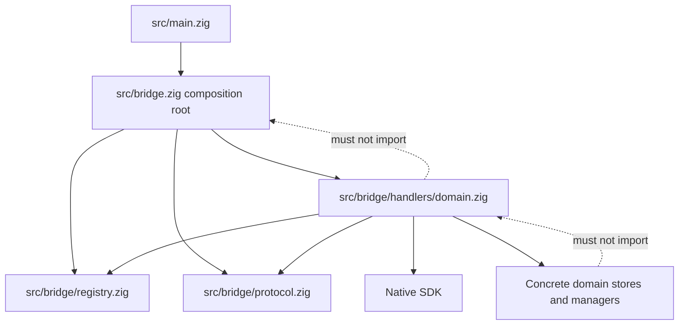
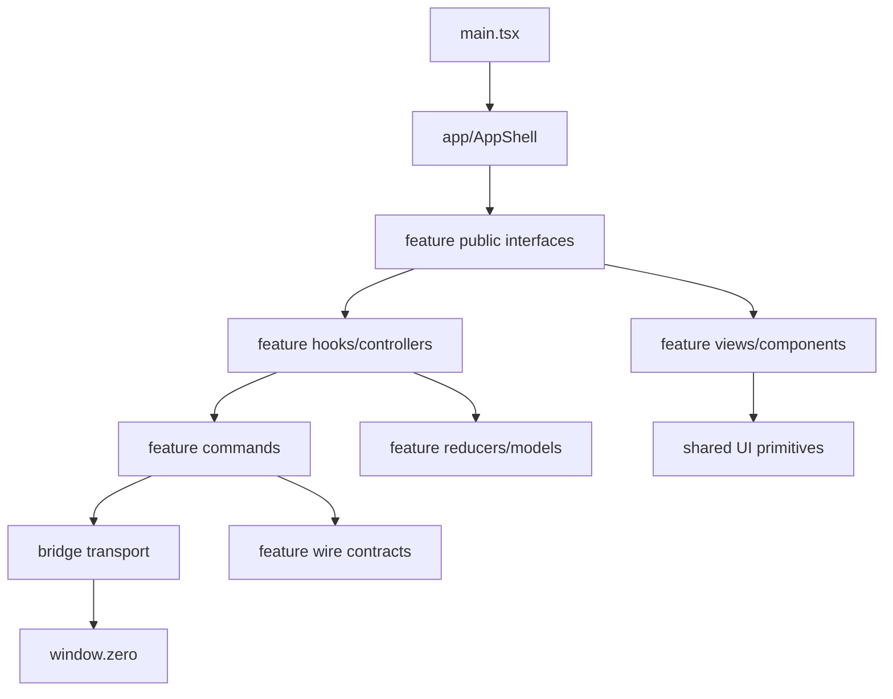

# Bridge and Frontend Decoupling Research and Migration Plan

**Status:** Proposed plan; no implementation changes are included in this note.
**Repository:** `oars`
**Checked:** 2026-08-22
**Scope examined:** the active worktree, including uncommitted changes in the bridge, app shell, backup feature, shared frontend contracts, and styles. Exact line counts below are research snapshots, not invariants; several edited files changed while the review was in progress.

## Executive verdict

**Yes: `src/bridge.zig` and the large frontend files can be decoupled without a rewrite.** The work is technically feasible with the current Zig and React architecture. The expected risk is **medium overall**, because the bridge exposes 127 native commands and several frontend views own long-lived asynchronous state. Most slices can be kept **low-to-medium risk**, but worker/lifecycle-heavy domains remain medium risk even when their files are small. Preserve command contracts, retain compatibility façades, move one domain at a time, and validate each new seam before removing the old path.

The goal should not be smaller files as an end in itself. The goal is to create deeper modules:

- a small, stable **interface** hiding substantial bridge registration and protocol **implementation**;
- explicit **seams** between transport, feature commands, domain orchestration, and views;
- high **leverage**, where one registry declaration produces both handler and policy entries and one protocol helper standardizes all responses;
- strong **locality**, where a feature's contracts, state transitions, effects, views, tests, and styles are discoverable together;
- enough **depth** that consumers do not need to understand internal polling, serialization, credentials, or worker mechanics.

This should be an incremental structural migration, not a big-bang redesign. Keep `src/bridge.zig`, `frontend/src/bridge.ts`, `frontend/src/types.ts`, and root tab files as compatibility façades while call sites move.

## Decision summary

| Question | Answer |
| --- | --- |
| Can the backend bridge be split? | **Yes.** Its 127 handlers already form recognizable domain clusters. A composition root plus protocol, registry, and domain handler modules is a natural fit. |
| Can the frontend be split similarly? | **Yes, but not by mechanically mirroring files.** Useful frontend modules should follow feature ownership and isolate state/effect seams from views while preserving React state identity. |
| Is a rewrite required? | **No.** Existing imports and command envelopes can remain stable through compatibility façades and per-domain registry migration. |
| Expected risk | **Medium overall.** Synchronous slices can be low-to-medium; worker/lifecycle slices such as Agent are medium risk. Main risks are contract drift, movable erased-context pointers, undiscovered Zig tests, React remounts, async cleanup regressions, CSS order changes, and conflicts with active backup work. |
| Recommended first slice | Establish the backend registry/protocol and frontend leaf transport first, then use **SSH Agent as the first full vertical pilot** after explicitly repairing its existing frontend contract mismatch and adding forwarding-lifetime coverage. Agent is low-conflict but not low-risk. |
| What should not happen? | No big-bang rewrite, no one-handler-per-file or one-small-component-per-file fragmentation, no speculative interfaces around every store, no broad `Context` threaded through all new modules, and no concurrent backup/registry restructuring. |

## How to read “module” in this plan

A **module** is a cohesive unit with a small interface that hides meaningful implementation detail. A React component is not automatically a module. For example, `features/logs` is a module because it can own contracts, commands, state transitions, lifecycle hooks, views, tests, and styles behind a narrow feature interface. `LogViewer.tsx` is a component inside that module; extracting a three-line label into its own file would not create useful modularity.

A **seam** is a boundary where behavior can be composed, tested, or varied independently. A native invocation transport is a real seam. The credential store is an adapter at a native-system boundary. A repository interface wrapped around a concrete store with only one implementation is not yet a useful seam; it adds indirection without depth.

## Current backend architecture

### Scale and responsibility concentration

`src/bridge.zig` is roughly 13,000 lines and declares `handler_count = 127`. It was observed growing from 12,921 to 13,023 lines during this research because the worktree is active. The stable architectural fact is the command surface, not the exact line count. Those handlers distribute across domains as follows:

| Domain | Handler count |
| --- | ---: |
| Servers | 3 |
| SSH | 9 |
| Monitor | 5 |
| Logs | 5 |
| Local | 1 |
| SFTP | 16 |
| Scripts | 10 |
| Deploy | 13 |
| SSH keys | 15 |
| Access | 13 |
| Backup | 18 |
| AI | 4 |
| VNC | 5 |
| History | 3 |
| Audit | 2 |
| Vault | 3 |
| Agent | 2 |
| **Total** | **127** |

The file is not one undifferentiated algorithm. It contains several recognizable kinds of implementation:

1. Native SDK dispatcher and policy registration.
2. Shared invocation mechanics and JSON response/error handling.
3. Wire payload declarations and validation.
4. Domain orchestration against concrete stores and managers.
5. Serialization and user-facing error translation.
6. Remote command construction and capability probes.
7. Worker/job drivers, polling, and cancellation behavior.
8. Embedded unit tests for selected implementation details.

That concentration makes the file expensive to navigate and raises the conflict surface for unrelated work. At the same time, the recognizable clusters make incremental extraction feasible.

### `Context` is a broad composition object

The current `Context` contains 14 runtime dependencies, in addition to owned handler and policy arrays. Its dependencies cover allocator and I/O, server storage, SSH sessions, audit, history, logs, scripts, deployment applications/history, access, SSH keys, backup, and AI. It is also address-sensitive: the backup coordinator installs an observer whose erased context pointer points back to this `Context`.

The broad context has three consequences:

- Every handler can see dependencies it does not need, so dependency ownership is implicit.
- Tests that need the dispatcher inherit the construction cost of unrelated stores and registries.
- Lifetime alone is insufficient: after observers or SDK handlers capture its address, the context must not be copied or moved.

`src/main.zig` demonstrates the second issue. Its `TestApp` fixture constructs the full application dependency graph and a full `bridge.Context` even for one-domain dispatcher tests. This is a test-locality problem: validating a narrow command requires understanding and constructing unrelated infrastructure.

The broad context is still useful as a temporary compatibility boundary. It should not be deleted first. During migration it can remain the composition-owned storage from which narrow domain contexts are initialized. The target is not “no context”; it is contexts whose fields communicate exactly what each domain handler group uses. Production already allocates `App` and initializes it in place; the extracted composition root should make this non-moving requirement explicit rather than relying on convention.

### Dispatcher registration duplicates the contract surface

`Context.dispatcher()` currently owns two parallel 127-entry collections:

- `BridgeHandler` entries associating command names with invocation functions and context pointers;
- matching `BridgeCommandPolicy` entries repeating the same command names.

This is a high-risk duplication because a command rename, addition, removal, or reorder can drift between the handler and policy tables. The command name should have one source of truth. A registry descriptor can provide leverage by deriving both SDK entries from a single declaration.

The registry must preserve all 127 command names and policies exactly during structural migration. It should also assert the total count and reject duplicate names. The count assertion protects omissions; duplicate detection protects collisions that a count alone cannot catch.

### Shared payload and response mechanics are shallow but valuable

Shared mechanics near the top of `src/bridge.zig` include:

- `contextOf`
- `HandlerFn`
- `respondError`
- `ok_json`
- `parsePayload`

Most handlers repeat the same broad flow:

1. recover typed context from the SDK callback context;
2. parse a wire payload;
3. validate input;
4. orchestrate calls to concrete stores or `sessions.Manager`;
5. serialize a successful response;
6. translate failures to the bridge's user-facing error envelope.

These mechanics belong in a protocol module because they form a stable, reusable interface over invocation details. They should not absorb domain semantics. For example, decoding backup-specific error details should remain with backup behavior, not become a generic transport responsibility.

There are important exceptions to preserve. Agent handlers currently parse directly with `std.json.parseFromSlice`, explicit allocation behavior, and `max_value_len` rather than using the shared helper. Extraction must carry those constraints across exactly or deliberately extend the protocol helper to express them. “Deduplicating” by silently changing limits or allocation behavior would be a contract or reliability change, not a structural move.

### Domain clusters include more than handlers

A domain extraction should move a coherent vertical cluster, not only callback functions. Depending on the domain, that cluster can include:

- wire payload structs;
- validation and serialization;
- command construction and escaping;
- polling and worker state;
- capability probes;
- cancellation transitions;
- bridge-specific orchestration;
- tests for those private details.

Moving only the public handler while leaving all its private implementation in `src/bridge.zig` would create a pass-through layer with little depth. Conversely, moving shared core domain behavior into a bridge directory would invert dependencies. Core files should not import bridge adapter code.

### Tests and Zig discovery constraints

`src/bridge.zig` currently embeds seven tests covering:

- deploy cancellation status;
- deploy SSH setup command construction;
- roles manifest validation;
- logs scan command escaping;
- three backup payload/credential cases.

`src/main.zig` was about 2,076 lines at final review and contains 25 tests. `build.zig` creates a test artifact using the `src/main.zig` application module as its root, supports `-Dtest-filter`, and runs that artifact. This matters because Zig discovers declarations lazily: moving tests into a new file does not guarantee that the test root imports and analyzes that file.

Official Zig documentation describes imported source files as file structs, explains lazy file/declaration discovery, and permits tests beside implementation or in separate files. The build-system test flow also has separate compile and run steps. Therefore, each extracted test module must be deliberately reachable from the test root, and both `zig build` and `zig build test` remain necessary validation rather than interchangeable commands.

## Backend target architecture

### Candidate structure

```text
src/bridge.zig
src/bridge/protocol.zig
src/bridge/registry.zig
src/bridge/handlers/servers.zig
src/bridge/handlers/ssh.zig
src/bridge/handlers/monitor.zig
src/bridge/handlers/logs.zig
src/bridge/handlers/local.zig
src/bridge/handlers/sftp.zig
src/bridge/handlers/scripts.zig
src/bridge/handlers/deploy.zig
src/bridge/handlers/sshkeys.zig
src/bridge/handlers/access.zig
src/bridge/handlers/backup.zig
src/bridge/handlers/ai.zig
src/bridge/handlers/vnc.zig
src/bridge/handlers/history.zig
src/bridge/handlers/audit.zig
src/bridge/handlers/vault.zig
src/bridge/handlers/agent.zig
src/bridge/tests.zig
```

The separate `audit.zig` entry is intentional: audit currently has its own two-command domain in the dispatcher and should have explicit ownership even if history and audit are migrated in the same phase. If close inspection during extraction shows their implementation has one cohesive invariant and one naturally narrow context, they can instead share a `history_audit.zig` module. That decision should be based on depth and locality, not line count.

### Ownership rules

#### `src/bridge/protocol.zig`

Own only cross-domain bridge protocol mechanics:

- typed callback-context recovery;
- payload parsing options and parse-error mapping;
- success serialization and SDK response-buffer handling;
- generic failure-envelope construction;
- protocol-level limits that truly apply to every feature.

It must not know what a backup repository is, how VNC setup works, or which deploy status is cancelable. Its interface should be small enough that handler modules depend on protocol behavior without depending on one another.

#### `src/bridge/registry.zig`

Own the command descriptor and registry validation:

- one canonical command name per entry;
- invocation function and late-bound context pointer;
- policy fields associated with that same command declaration;
- the shared `allowed_origins` default, re-exported by `src/bridge.zig` for existing `src/main.zig` callers;
- derivation of Native SDK handler and policy arrays;
- compile-time/static name and count checks where practical, plus duplicate validation.

Handler command specifications should not import the root merely to obtain origins. Prefer static command specifications plus late runtime context binding: names and policy defaults can be checked before runtime, while final `*anyopaque` pointers are materialized only after contexts occupy their final addresses. The exact Zig representation should follow what the SDK types permit, but conceptually one descriptor should generate both parallel SDK records. This is the highest-leverage structural change because it removes 127 duplicated command names and makes omissions observable at composition time.

#### `src/bridge/handlers/<domain>.zig`

Each domain handler module should own:

- a narrow, concrete `Context` containing only dependencies used by that domain;
- wire payload and response types for its commands;
- private handler implementations;
- domain-specific parsing constraints and error translation;
- bridge-specific orchestration, serialization, command generation, probes, and workers where applicable;
- a small exported registry interface, such as command entries/count and context initialization needs.

Its public interface should not expose every private helper. The point is to hide a substantial implementation behind a compact registration surface.

#### `src/bridge.zig`

Keep this path as the stable public façade and composition root initially. It should:

- preserve imports currently used by `src/main.zig`;
- own stable, non-moving storage for all domain contexts and SDK arrays;
- initialize narrow domain contexts directly in their final storage before binding erased pointers;
- compose each domain's registry entries;
- assert that the total is exactly 127 throughout migration;
- reject duplicate command names;
- create the Native SDK dispatcher.

It should become small, but not empty. Composition is a real responsibility. A façade that merely re-exports hundreds of private declarations would not improve depth.

### Dependency direction and cycle prevention

The intended dependency graph is:



Guardrails:

- Handler modules never import `src/bridge.zig`.
- Core domain files never import bridge files.
- The root imports child modules, never the reverse.
- Shared helper code moves to `protocol.zig` only when it is genuinely transport-level; otherwise it stays with the owning domain.
- Cross-domain reuse should be proven before creating another shared module. Premature “common” directories often reduce locality and create cycles.

### Context slicing without premature interfaces

Do not introduce repository, service, or session interfaces merely because code moves to another file. The current stores and `sessions.Manager` have concrete implementations. Wrapping each in a one-implementation interface would create hypothetical seams, more allocation/lifetime decisions, and more concepts without meaningful depth.

Instead:

1. Define a concrete context per extracted domain.
2. Include only the allocator, I/O, manager, store, and audit/history dependencies that domain actually uses.
3. Let the composition root own those contexts as fields or other address-stable storage.
4. Initialize the composition root and each narrow context in final storage; do not return an already-wired root by value.
5. Only then bind their addresses into SDK registry entries, and never copy or move the root afterward.
6. Introduce an interface or adapter only when there is actual implementation variation or a real external boundary.

The address point is critical. SDK entries use erased context pointers, so a context initialized as a temporary local and then referenced through `*anyopaque` would become invalid. A context that technically outlives the dispatcher can still be wrong if it moves to a new address. During migration, the broad `Context` can own each narrow context as a field or otherwise provide stable composition-owned storage before registration.

Adapters remain appropriate at real seams—for example, native dialogs, credentials/Keychain, or an external process boundary—but “adapter” should not be used as a synonym for every wrapper.

### Transitional registry composition

The registry can support legacy and extracted handlers simultaneously:

- Existing handlers remain defined in `src/bridge.zig` while their domains have not moved.
- New domain modules export descriptors for extracted commands.
- The composition root appends both sets into one registry.
- Both are transformed into the SDK's handler and policy arrays from the same descriptor source.
- The combined registry must contain exactly 127 unique commands.

That makes migration reversible one domain at a time. It also avoids forcing a simultaneous rewrite of `src/main.zig` or all handlers.

## Current frontend architecture

### Existing useful patterns

The frontend already demonstrates a useful intermediate feature-oriented organization:

- `frontend/src/features/deploy` combines an orchestration tab with focused hooks and view components.
- `frontend/src/features/files` owns focused hooks, dialogs, transfer helpers, and a root compatibility re-export.
- `frontend/src/features/logs` and `frontend/src/features/scripts` already exist as directories and can receive migrated ownership.

These are better precedents than a generic `components/` folder and already improve view/state locality. They are not yet proof of the full target dependency direction: deploy and files still import command wrappers and wire contracts from root `bridge.ts` and `types.ts`. Treat them as an intermediate pattern to deepen, not an architecture to copy unchanged.

### `frontend/src/App.tsx` — 1,362 lines

`App.tsx` currently combines:

- server loading and error state;
- tab identity, active tab, and status maps;
- navigation, mobile, and sidebar state;
- theme persistence and View Transition handling;
- mosaic workspace layout and persistence;
- command palette data and actions;
- server CRUD integration;
- pane rendering and feature routing;
- fleet, overview, and server views;
- backup protection UI;
- global keyboard and event effects.

This is primarily an application-shell composition problem, not a reason to put every JSX block in a separate file. The strongest seams are workspace state, navigation derivation, shell effects, and pane rendering.

Behavior that must remain exact:

- `TerminalTab` stays mounted and is hidden rather than conditionally unmounted.
- Other feature views remain conditionally mounted unless a deliberate product change says otherwise.
- Mosaic leaf IDs derived from `tab.key` continue to distinguish mirrored panes and map each leaf to the correct pane.
- Closing the final pane for a server triggers disconnect.
- State must not move to a different tree position/type/key accidentally.

React's official guidance is explicit that state identity is tied to a component's position in the rendered tree, including type and keys. A visually equivalent extraction can still reset terminal, editor, or connection state if it changes that identity. The current tests do not directly prove terminal survival across view changes, independent mirrored-terminal state, layout reorder without remount, or disconnect only after the final pane closes; add those observable checks before shell extraction.

### `frontend/src/ScriptsTab.tsx` — 1,602 lines

This file contains several distinct state machines:

- script library/filter/selection;
- editor validation and save/delete flows;
- single-run variables, output, polling, and channel cleanup;
- two-phase broadcast flow: targets → variables → prepared confirmation → destructive confirmation → running;
- timers, sequence guards, cursor refs, unmount cleanup;
- dialogs and large library/detail/output views.

`frontend/src/scripts-state.ts` already contains pure, tested rules. That is evidence of a useful state seam. Candidate ownership:

- `useScriptLibrary`
- `useSingleScriptRun`
- `useBroadcastRun`
- a pure broadcast reducer
- library, detail, and output components
- editor, run, and broadcast dialogs

A reducer is suitable for the broadcast flow because its transitions are related and ordered. It should remain pure. Independent UI fields do not need to be forced into the same reducer.

### `frontend/src/LogsTab.tsx` — 1,303 lines

This file combines:

- scan lifecycle;
- selected-source read lifecycle with generation tokens;
- live follow channel and polling;
- virtualized rendering and search;
- identity-bound clear flow;
- SFTP download flow and polling;
- manual source creation;
- notices and keyboard navigation.

Critical invariants include:

- retain generation/request tokens that reject stale work;
- keep polls non-overlapping;
- close the follow channel on every exit path;
- require rescan and reconfirmation for stale clear previews;
- preserve follow-output caps and dropped-byte reporting;
- retain download transfer identity and cancellation.

Candidate seams:

- `useLogSources`
- `useLogReader`
- `useLogFollow`
- `useLogDownload`
- `LogSourceRail`
- `LogViewer`
- `DownloadStatus`
- `LogClearDialog`

Existing `logs-state.ts` and `log-view-state.ts` should move into the feature module with their tests rather than being replaced.

### `frontend/src/BackupsTab.tsx` — 1,253 lines

Current uncommitted work already introduces `frontend/src/backup-state.ts`, a substantial 893-line controller with:

- `BackupController`;
- `useSyncExternalStore` integration;
- polling and reconciliation;
- operation, run, and history state;
- credential helpers and error translation;
- injectable `BackupBridge` and credential-store seams.

This is evidence of a useful deep module: a comparatively small controller interface hides asynchronous reconciliation and credential behavior. Do not fragment it merely to reduce its line count. Split internals later only where doing so improves ownership and locality.

`BackupsTab.tsx` still owns transient editor, review, test, save, delete, run, install, and staged credential-cleanup flows. A later target is:

```text
frontend/src/features/backups/controller.ts
frontend/src/features/backups/useBackupState.ts
frontend/src/features/backups/credentials.ts
frontend/src/features/backups/model.ts
frontend/src/features/backups/contracts.ts
frontend/src/features/backups/commands.ts
frontend/src/features/backups/BackupsTab.tsx
frontend/src/features/backups/components/*
frontend/src/features/backups/dialogs/*
```

Backups should not be the first migration slice. The feature is under active user development, and bridge/registry work would overlap the same large files.

### `frontend/src/VncTab.tsx` — 1,146 lines

This file combines:

- display and port selection;
- tunnel start/stop/polling;
- imperative noVNC `RFB` lifecycle and listener detachment;
- credentials and Keychain behavior;
- setup probe, dry run, approval, and execution;
- clipboard and scaling;
- large JSX with extensive inline styles.

Critical behavior to preserve:

- tunnel and RFB teardown remain idempotent;
- sequence guards prevent orphan tunnel starts;
- noVNC owns only its target DOM node;
- server switches clean up prior resources;
- event listeners are detached;
- credential challenge, retry, and manage actions remain distinct;
- setup re-probes and requires dry-run approval where it does today.

Candidate seams:

- `useVncSession`
- `useVncSetup`
- `useVncCredentials`
- pure state/model code derived from existing `vnc-state.ts`
- `VncToolbar`
- `VncCanvas`
- credentials and setup dialogs
- feature-owned CSS replacing inline styles incrementally

### `frontend/src/types.ts` — about 1,067 lines at final review

This file is a cross-feature wire-contract warehouse. It makes unrelated features share one change surface and obscures ownership between raw native responses and UI state.

Raw wire contracts should move to the feature that owns the command. They should remain separate from derived UI models. The root file can temporarily re-export migrated types so existing imports do not need to change in one commit.

### `frontend/src/bridge.ts` — 654 lines

This file currently knows:

- generic `window.zero` invocation transport;
- generic errors;
- backup-specific failure-detail decoding;
- Keychain cache and policies;
- native dialogs;
- command wrappers for every feature.

Those are different responsibilities. There is one migration prerequisite: generic `invoke` and `BridgeError` currently decode `BackupFailureDetail` for every command, so feature commands cannot safely import the root file while that root imports them back. Establish an acyclic leaf transport first. The target separation is:

```text
frontend/src/bridge/transport.ts
frontend/src/bridge/errors.ts
frontend/src/bridge/credentials.ts
frontend/src/bridge/dialogs.ts
frontend/src/bridge/index.ts
frontend/src/features/<feature>/contracts.ts
frontend/src/features/<feature>/commands.ts
```

Ownership rules:

- `transport.ts` knows only how to invoke a command and normalize generic failure envelopes. Its error type can be generic over decoded detail and accept an optional detail decoder; it must not import backup contracts.
- During transition, root `bridge.ts` keeps a legacy wrapper that delegates to the leaf transport with the existing backup-detail decoder, preserving current behavior for unmigrated commands.
- Feature `commands.ts` files import only the leaf transport and own command literals, payload construction, response types, and feature-specific error decoding.
- Root `bridge.ts` may import and re-export migrated feature commands because those feature modules no longer import the root, avoiding a runtime cycle.
- Backup-specific failure decoding ultimately belongs to backups, not generic transport.
- Credentials and dialogs are concrete adapters at native seams.
- Wire contracts remain distinct from view state and derived models.
- Use `import type` for type-only dependencies so contract imports do not create runtime edges.
- Avoid broad runtime barrels that make cycles easy to hide.

TypeScript's official module documentation confirms that files with top-level imports/exports are modules and that `import type` is erased from runtime output. That is useful for maintaining an explicit, acyclic dependency direction.

### `frontend/src/index.css` — 2,482 lines

The stylesheet combines:

- global tokens and base styles;
- application shell layout;
- shared controls;
- feature-specific selector families;
- responsive variants;
- feature animations and reduced-motion handling.

It should be split by ownership, not arbitrary size:

```text
frontend/src/styles/tokens.css
frontend/src/styles/base.css
frontend/src/styles/shell.css
frontend/src/styles/shared.css
frontend/src/features/<feature>/<feature>.css
```

Keep deterministic import order in `main.tsx` or a thin `index.css` aggregator. Move complete selector families together with their media queries, keyframes, and reduced-motion rules. Do not combine this migration with CSS Modules or a class-naming rewrite; that would create broad markup churn and make regressions harder to attribute.

## Frontend target architecture

```text
frontend/src/app/AppShell.tsx
frontend/src/app/navigation.ts
frontend/src/app/workspace/model.ts
frontend/src/app/workspace/useWorkspace.ts
frontend/src/app/components/Sidebar.tsx
frontend/src/app/components/Topbar.tsx
frontend/src/app/components/WorkspaceMosaic.tsx

frontend/src/bridge/transport.ts
frontend/src/bridge/errors.ts
frontend/src/bridge/credentials.ts
frontend/src/bridge/dialogs.ts
frontend/src/bridge/index.ts

frontend/src/features/fleet/*
frontend/src/features/scripts/*
frontend/src/features/logs/*
frontend/src/features/backups/*
frontend/src/features/vnc/*
frontend/src/features/agent/*

frontend/src/styles/tokens.css
frontend/src/styles/base.css
frontend/src/styles/shell.css
frontend/src/styles/shared.css
```

### Dependency direction



Rules:

- The shell imports a feature's public tab/view, not its internal hooks, command helpers, or reducers.
- Features may import bridge primitives and shared UI, but not another feature's internals.
- Feature command wrappers depend inward on generic transport; generic transport never imports a feature.
- Pure models do not invoke the bridge or touch timers.
- Hooks/controllers own effects and cleanup; views receive state and actions through explicit props or a narrow feature interface.
- Shared UI extraction requires demonstrated cross-feature semantics, not merely similar markup.

### State, reducer, hook, and view seams

Use each tool for the responsibility it handles well:

- **Pure model/reducer:** related state transitions, validation, reconciliation decisions, and race-resistant state machines. Reducers must remain pure.
- **Custom hook/controller:** concrete stateful behavior such as polling, subscriptions, sequence guards, abort/cleanup, and command orchestration. React's guidance is that custom hooks share stateful logic, not state itself; each call is independent.
- **View/component:** rendering and local interaction semantics, with non-trivial props that form a useful interface.
- **Command wrapper:** typed bridge command literal, payload construction, response contract, and feature-level error decoding.
- **Transport adapter:** generic native invocation only.

Do not move state merely to make a parent file shorter. The new owner should improve the interface or make an invariant testable. For long-lived tabs, verify tree position, component type, and keys before and after extraction.

### Component extraction criteria

Create a separate component file only when at least one is true:

- it has an independent semantic responsibility;
- it exposes a meaningful, non-trivial props interface;
- it owns reusable interaction or accessibility behavior;
- it isolates substantial rendering complexity;
- it creates a testable lifecycle or state seam.

Do not create one file for every small presentational fragment. That lowers locality by forcing navigation through many shallow files.

## Current-file-to-target mapping

| Current file | Current concentration | Candidate target ownership | Compatibility strategy |
| --- | --- | --- | --- |
| `src/bridge.zig` | Protocol mechanics, 127 handlers, policies, domain implementation, tests | `bridge/protocol.zig`, `bridge/registry.zig`, `bridge/handlers/*.zig`, `bridge/tests.zig`; root remains composition façade | Preserve `src/bridge.zig` imports and public entry points until all domains migrate |
| `src/main.zig` | App composition plus full `TestApp` bridge fixture | Keep app composition; add focused domain test fixtures or direct domain dispatcher construction as handlers move | Do not rewrite constructor call sites up front; broad context can initialize narrow contexts during transition |
| `frontend/src/App.tsx` | Shell, workspace, navigation, persistence, feature routing, global effects | `app/AppShell.tsx`, `app/navigation.ts`, `app/workspace/model.ts`, `app/workspace/useWorkspace.ts`, shell components | Root `App.tsx` can re-export/render `AppShell` after tree/key behavior is verified |
| `frontend/src/ScriptsTab.tsx` | Library/editor/run/broadcast state machines and views | `features/scripts/ScriptsTab.tsx`, hooks, reducer/model, components, dialogs, commands/contracts | Root tab re-export; move one state machine at a time |
| `frontend/src/LogsTab.tsx` | Scan/read/follow/download/clear lifecycles and views | `features/logs/LogsTab.tsx`, hooks, existing state models, components/dialogs, commands/contracts | Root tab re-export; preserve generation tokens and cleanup invariants |
| `frontend/src/BackupsTab.tsx` and `backup-state.ts` | Deep controller plus transient editing/review/credential flows | `features/backups/controller.ts`, model, hook, credentials, commands/contracts, views/dialogs | Defer until active work settles; preserve controller interface rather than fragmenting it |
| `frontend/src/VncTab.tsx` | Tunnel/RFB/setup/credentials lifecycles plus views and inline style | `features/vnc` hooks, model, commands/contracts, toolbar/canvas/dialogs, CSS | Root tab re-export; extract lifecycle hooks before visual rearrangement |
| `frontend/src/types.ts` | All feature wire contracts | `features/<feature>/contracts.ts`; shared protocol types only where truly shared | Re-export moved types from root during migration |
| `frontend/src/bridge.ts` | Transport, errors, credentials, dialogs, all commands | `bridge/*` primitives plus `features/<feature>/commands.ts` | Re-export command wrappers until imports migrate |
| `frontend/src/index.css` | Tokens, base, shell, shared controls, all feature CSS | `styles/*` and `features/<feature>/<feature>.css` | Thin ordered aggregator; move complete selector families without renaming |

## Phased migration plan

Each phase is independently reviewable and should leave the application buildable. Backend, frontend, and CSS movement should not be combined into one mega-commit.

### Phase 0 — Baseline, contract inventory, and lifecycle anchors

**Purpose:** make structural drift and pre-existing mismatches visible before moving code.

1. Snapshot the exact 127 command names and current policies in a test or checked fixture.
2. Assert there are exactly 127 unique commands.
3. Capture representative success and failure envelopes, including commands with special payload limits or feature-specific detail fields.
4. Identify which bridge tests are already reachable through production imports and which standalone test files require explicit test-root discovery.
5. Record frontend command literals, payload shapes, and response types by feature.
6. Record the existing Agent mismatch explicitly: backend and TypeScript contracts return `identities`, while `AgentTab` and the mock read/return `agents` or `sockets`.
7. Add observable App-level tests for terminal survival across view changes, independent mirrored panes, Mosaic reorder without remount, and disconnect only after the final server pane closes.
8. Record lifecycle invariants for scripts, logs, backups, and VNC in existing or focused tests.

**Exit criteria:** no structural moves; command count, uniqueness, policies, representative envelopes, and critical UI lifecycle behavior are mechanically checked; known contract bugs are documented rather than accidentally preserved.

### Phase 1 — Introduce the backend protocol and registry seam

**Purpose:** remove command-name duplication and establish safe composition without moving all domain implementation.

1. Add `src/bridge/protocol.zig` for existing generic mechanics.
2. Add `src/bridge/registry.zig` with static command specifications, the shared origin default, and one descriptor source for handler and policy records.
3. Adapt legacy registrations to descriptors while handlers remain in place.
4. Initialize the composition root in final storage, then late-bind context pointers and generate both SDK arrays.
5. Add count and duplicate checks; keep `allowed_origins` available through the existing root façade.
6. Keep `src/bridge.zig` as the public path and non-moving storage owner.

**Exit criteria:** exactly 127 unique commands; generated handler/policy names cannot drift; all erased pointers target final, immobile storage; no payload, response, policy, or error behavior changes.

### Phase 2 — Establish the frontend leaf transport

**Purpose:** create an acyclic seam that feature commands can depend on before any root façade imports them.

1. Add `frontend/src/bridge/transport.ts` and `frontend/src/bridge/errors.ts`.
2. Make the error type generic over feature detail and let callers optionally provide a detail decoder; the leaf must not import backup contracts.
3. Keep root `frontend/src/bridge.ts` as a compatibility façade whose legacy wrapper delegates to the leaf with the current backup-detail decoder, preserving existing unmigrated behavior.
4. Leave feature command wrappers in the root initially.
5. Add transport tests for missing bridge, thrown invocation, `{ok:false}`, retryability, fallback codes/messages, and optional detail decoding.

**Exit criteria:** existing root callers observe the same errors and details; a new feature command file can import the leaf transport without importing the root or creating a runtime cycle.

### Phase 3 — Repair and anchor the Agent contract

**Purpose:** separate a real product-contract fix from the structural extraction that follows.

1. Update `AgentTab` to consume the declared `identities` response and render identity kind, fingerprint, and comment instead of legacy socket-shaped fields.
2. Update the bridge mock from `{agents: []}` to `{identities: []}`.
3. Add a frontend behavior test for empty/no-agent and populated identity responses.
4. Add focused backend coverage for `ForwardSetOutcome` success, refusal, timeout/abandonment ownership, and eventual worker-side destruction.
5. Define and test the audit semantics explicitly, including what should happen if forwarding succeeds but audit persistence fails.
6. Keep this as a separate reviewable contract-repair change; do not hide it inside a file move.

**Exit criteria:** backend, TypeScript contract, mock, and view agree on `identities`; forwarding ownership and audit behavior have explicit tests.

### Phase 4 — First full vertical slice: SSH Agent

**Purpose:** prove the architecture on a small but meaningful medium-risk feature after its prerequisites are in place.

Backend:

1. Add `src/bridge/handlers/agent.zig`.
2. Give it a narrow concrete context containing allocator, I/O, session manager, and audit dependencies.
3. Move both handlers, payloads, special 4096-byte parsing constraints, SSH Agent/libssh2 orchestration, forwarding wait/abandon behavior, error translation, and relevant tests.
4. Export Agent command specifications through `registry.zig` without importing root `bridge.zig`.

Frontend:

1. Add `frontend/src/features/agent/contracts.ts`.
2. Add `frontend/src/features/agent/commands.ts` importing only the leaf transport.
3. Move the approximately 80-line view into `frontend/src/features/agent/AgentTab.tsx` without changing its rendered identity.
4. Keep root Agent, type, and bridge paths as compatibility re-exports until callers migrate.

**Exit criteria:** the corrected contract, command literals, policies, parsing limits, response envelopes, forwarding ownership, and context address remain stable; focused tests and full builds pass; total command count remains 127.

### Phase 5 — Continue feature-oriented vertical slices

Suggested backend order after Agent:

1. history and audit;
2. monitor;
3. AI;
4. vault after checking its broad import/export context;
5. servers and SSH;
6. logs and scripts;
7. larger worker-heavy domains: SFTP, deploy, SSH keys, access;
8. backups last, after active backup work settles.

For each domain, migrate backend handlers and frontend commands/contracts together where practical. Move state/view code in that same slice only when it creates a useful seam; do not force every backend extraction to trigger a visual refactor.

For every domain:

- define the narrow context first and initialize it in final storage;
- move wire contracts and private bridge implementation together;
- preserve names, policies, payloads, envelopes, limits, and buffer ownership;
- use the leaf frontend transport and keep feature error decoding local;
- verify test discovery rather than adding redundant root imports;
- remove the legacy registry entry only after the new entry passes the same fixtures;
- keep total command count at 127.

### Phase 6 — Extract frontend shell and stable state/effect seams

Treat this as an independent frontend project rather than a prerequisite for backend domain movement.

1. Extract a pure workspace model/reducer from `App.tsx` where transitions are related.
2. Extract `useWorkspace` for persistence and shell effects without changing Mosaic leaf IDs or pane mapping.
3. Extract navigation derivation and shell components with explicit props.
4. Keep `TerminalTab` mounted and hidden exactly as today.
5. Move stable feature seams one at a time:
   - scripts: library, single run, then broadcast;
   - logs: sources/read, follow, download, then clear dialog;
   - VNC: session lifecycle, setup, credentials, then views;
   - backups only after current controller work stabilizes.
6. Retain tests for cleanup, stale response guards, state transitions, and observable state preservation before moving large views.

**Exit criteria:** terminals survive normal rerenders/view changes, mirrored Mosaic leaves remain independent, final-pane disconnect behavior is unchanged, async resources close correctly, and the shell imports only feature public interfaces.

### Phase 7 — Move CSS by ownership

1. Establish `tokens.css`, `base.css`, `shell.css`, and `shared.css` with deterministic order.
2. Move complete, clearly prefixed feature selector families into the owning feature.
3. Move associated media queries, keyframes, and reduced-motion rules in the same change.
4. Do not rename classes while moving them.
5. Compare major responsive states and motion-reduction behavior after each move.

**Exit criteria:** computed behavior and import precedence remain unchanged; features own their selectors; global tokens and genuinely shared controls remain central.

### Phase 8 — Retire compatibility layers

Only after all consumers have migrated:

1. Remove legacy handler declarations and broad context fields no longer needed.
2. Remove obsolete re-exports from `frontend/src/types.ts`, `frontend/src/bridge.ts`, and root tab files.
3. Check for runtime barrel cycles and forbidden dependency directions.
4. Keep root composition entry points where they provide a stable, deep interface; do not remove a useful façade merely because migration is complete.

## Recommended first vertical slice in detail

### Why SSH Agent—after prerequisites

SSH Agent is the lowest-conflict full vertical pilot after current backup work, registry/transport foundations, and the Agent contract repair are stable:

- only two handlers, located at the end of `src/bridge.zig`;
- a small frontend surface (`AgentTab.tsx` is about 80 lines);
- contracts and wrappers are near the end of `types.ts` and `bridge.ts`;
- an existing dispatcher integration test provides a partial behavior anchor;
- it avoids moving backup implementation code under active development;
- it exercises a meaningful narrow context: allocator, I/O, session manager, and audit;
- its custom JSON parsing constraints prove that the protocol seam can support exceptions rather than erasing them;
- it validates backend composition, registry generation, typed frontend wrappers, compatibility re-exports, and test discovery in one bounded slice.

It is not a low-risk lifecycle slice. `agent.forward` allocates a cross-thread outcome, waits with a deadline, transfers destruction responsibility on abandonment, mutates the remote shell, and audits successful enablement. The existing integration test covers missing-agent behavior, Agent auth persistence, and immediate `NoSession`, but not successful forwarding, worker refusal, timeout/abandonment, or audit failure. The frontend also currently reads `agents`/`sockets` despite the backend and declared type returning `identities`. Those gaps must be resolved in Phase 3 before extraction.

### Candidate files

```text
src/bridge/protocol.zig
src/bridge/registry.zig
src/bridge/handlers/agent.zig
frontend/src/bridge/transport.ts
frontend/src/bridge/errors.ts
frontend/src/features/agent/contracts.ts
frontend/src/features/agent/commands.ts
frontend/src/features/agent/AgentTab.tsx
frontend/src/AgentTab.tsx
```

The backend foundation necessarily touches bridge composition. Because current backup work also changes `src/bridge.zig`, start it only after those changes have been committed, rebased, or otherwise stabilized. Build the frontend transport leaf before Agent commands, and land the Agent contract repair separately before moving files. Do not concurrently edit the handler/policy table while backup changes are unresolved.

### First-slice acceptance checklist

- [ ] 127 total and 127 unique commands before and after.
- [ ] Agent command names and policies are byte-for-byte unchanged.
- [ ] Payload parsing limits and allocation behavior are unchanged.
- [ ] Backend, declared contract, mock, and view agree on `identities` before the structural move.
- [ ] Success and error envelopes are unchanged after the explicit contract repair.
- [ ] Forwarding success, refusal, timeout/abandonment ownership, and audit semantics are covered.
- [ ] Domain context has no unrelated stores.
- [ ] Context storage is initialized at its final address and remains immobile for the dispatcher's lifetime.
- [ ] Agent handler module does not import root `bridge.zig`.
- [ ] Agent contracts and wrappers are feature-owned and import only the leaf transport.
- [ ] Generic frontend transport contains no Agent or backup semantics.
- [ ] Existing import paths continue through re-exports without runtime cycles.
- [ ] Dispatcher integration, full Zig tests, focused frontend tests, and frontend build pass.

## Test migration and build integration

### Backend test ownership

Use two layers:

1. **Domain-local tests** beside an extracted handler module or in a closely owned test file for parsing, validation, command generation, state transitions, and serialization. These should construct only the narrow domain context or pure helper inputs.
2. **Composition/integration tests** through the full dispatcher for command registration, policy, context wiring, and representative end-to-end envelopes.

`src/bridge/tests.zig` can aggregate shared bridge composition tests, but it must not become another monolith. Domain-specific pure tests should remain near their implementation for locality.

### Zig test discovery

Zig 0.16 lazily discovers files and declarations. A test file that exists on disk but is not reached from the test root may silently not run. An extracted handler module used by `bridge.dispatcher()` is already reachable through production imports; do not add redundant `src/main.zig` imports for every handler. Standalone aggregators such as `src/bridge/tests.zig`, or test-only modules not otherwise reached, do need explicit test-root discovery.

For every extraction:

- verify the new test is observed, using a focused filter where its name supports one;
- keep the full suite mandatory because existing core Agent tests do not all contain `agent` in their test names;
- run the test artifact, not only compilation;
- retain explicit imports/references only for standalone test modules that need discovery;
- run both `zig build` and `zig build test`, as required by the repository handover guidance.

### Frontend tests

Prioritize behavior-rich seams:

- reducer transition tables;
- stale-response and generation-token rejection;
- non-overlapping poll behavior;
- timer, channel, transfer, listener, and tunnel cleanup;
- credential challenge/retry state;
- state preservation across shell rerenders and mirrored pane keys.

Avoid snapshot-heavy tests whose only purpose is to freeze component extraction. The main regression risk is lifecycle behavior, not JSX formatting.

### Validation commands found in the repository

```sh
zig build
zig build test
zig build test -Dtest-filter="agent" # supplementary; not a substitute for the full suite
npm --prefix frontend run test
npm --prefix frontend run build
scripts/integration-test.sh
```

`scripts/integration-test.sh` starts the disposable SSH container and runs `zig build -j1 test`. Use `--summary all` when checking environment-gated integration tests so skipped versus executed steps are visible. The repository notes that environment variables are not part of Zig's run-step cache key, so force or confirm a visibly non-cached integration run rather than assuming the container-backed tests re-executed. `docs/HANDOVER.md` calls for both `zig build` and `zig build test` because Zig analysis is lazy.

No application build or test suite was run for this documentation-only task. The research work changed only this note; source-code edits visible in the active worktree are pre-existing/concurrent user work.

## Success metrics and guardrails

### Contract integrity

- Exactly **127 handlers** remain registered throughout migration.
- All 127 names are unique.
- Each command name and policy has one canonical registry declaration.
- No command name, payload, response, policy, parse limit, or error envelope changes without an explicit contract-change decision.
- Representative bridge fixtures pass before and after each domain move.

### Backend architecture

- `src/bridge.zig` becomes a composition façade with real ownership, not a pass-through dump.
- Every extracted handler group has a context containing only dependencies it uses.
- Contexts are initialized in final composition-owned storage and remain at the same address for the dispatcher's lifetime.
- No handler module imports root `src/bridge.zig`.
- No core domain file imports bridge adapter code.
- Domain tests can run without constructing unrelated stores.
- New test files are demonstrably discovered by the Zig test root.

### Frontend architecture

- The app shell imports feature public interfaces, not feature internals.
- Feature code imports generic transport/shared primitives, not other features' private code.
- Generic bridge transport has no feature-specific semantics.
- Wire contracts are separate from derived UI state.
- Reducers remain pure; hooks/controllers own effects and cleanup.
- Terminal state survives normal view changes and shell rerenders; Mosaic leaf IDs preserve independent mirrored-pane identity and final-pane disconnect semantics.
- Polling, timers, channels, transfers, RFB listeners, and tunnels pass cleanup tests.
- CSS moves preserve import order, responsive behavior, and reduced motion.

### Quality of modularity

- **Depth:** extracted modules hide substantial behavior behind small interfaces.
- **Leverage:** registry and protocol abstractions remove widespread duplication or make invariants centrally enforceable.
- **Locality:** understanding or changing a feature requires fewer unrelated files and dependencies.
- File count and line count are diagnostics only, not primary success measures.
- No gratuitous one-handler-per-file or one-small-component-per-file fragmentation.

## Risks and mitigations

| Risk | Why it matters | Mitigation |
| --- | --- | --- |
| Handler/policy drift or command rename | Native calls may fail or run under the wrong policy | One descriptor source, 127-count assertion, duplicate check, contract snapshot |
| Invalid or moved erased-context pointer | A `*anyopaque` pointer can become invalid even when the value still exists at a new address | Initialize composition/domain contexts directly in final storage; bind pointers afterward; prohibit copying/moving the wired root |
| Buffer ownership or error-envelope change | Can cause leaks, truncation, or frontend behavior changes | Move protocol mechanics first, preserve fixtures and feature-specific detail decoding |
| Special parse constraints lost | Large or malformed payload behavior may change | Inventory per-command parsing options; Agent slice explicitly proves exception support |
| Zig lazy discovery drops tests | A green test command may omit standalone moved tests | Confirm reachability; explicitly import only standalone test modules; verify focused tests and run the full suite |
| Hidden cross-domain helpers | Extraction can create cycles or misplaced “shared” code | Move cohesive clusters; keep helpers domain-local until reuse is proven |
| React state remount | Terminal/session/editor state may reset despite equivalent UI | Preserve tree position/type and Mosaic leaf-ID mapping; add observable identity-focused tests before shell extraction |
| Async resource leaks | Polls, channels, transfers, and tunnels can outlive views | Preserve sequence guards; test all success, error, switch, and unmount exits |
| Runtime barrel cycle | TypeScript imports can become partially initialized | Prefer direct internal imports, narrow public barrels, and `import type` |
| CSS order regression | Same selectors can compute differently after a move | Deterministic aggregator; move whole selector/media/keyframe families without renaming |
| Backup merge conflicts | Current user work touches both backend and frontend monoliths | Defer backup extraction and registry edits until the work settles; start with Agent |
| Shallow extraction | More files but no simpler interface or locality | Require an ownership/invariant reason for each extraction; review module depth |

## Rollback strategy

1. Make one domain a reviewable migration unit; do not mix several domains or unrelated CSS changes.
2. Retain the old handler implementation until the new domain passes the same dispatcher and contract fixtures.
3. Keep compatibility façades and re-exports so a frontend or backend slice can be reverted independently.
4. If an extracted domain fails, point only that domain's registry descriptors back to the legacy handlers while keeping the protocol/registry infrastructure.
5. Do not remove broad context fields or root exports until all consumers have migrated.
6. Use `git diff --check` and the command-name snapshot to catch structural mistakes before review.
7. Keep backend, frontend command ownership, view extraction, and CSS movement in separate commits so regressions can be bisected and reverted cleanly.

## What not to do

- **Do not perform a big-bang rewrite.** The command surface and asynchronous UI behavior make it unnecessarily risky.
- **Do not split mechanically by line count.** One handler per file and one tiny component per file create shallow indirection and poor locality.
- **Do not add abstract repository/service interfaces around every concrete store.** Introduce interfaces only when there is real variation or a testing/ownership seam that pays for the complexity.
- **Do not pass the existing broad root `Context` unchanged into every new handler module.** That preserves the original coupling under new filenames.
- **Do not let child handler modules import `src/bridge.zig`.** It creates parent/child cycles and reverses composition ownership.
- **Do not return an already-wired composition root by value or move it after registration.** Erased handler and observer pointers require address stability.
- **Do not duplicate command names between handler and policy tables.** Registration must have one source of truth.
- **Do not make generic frontend transport understand backup, VNC, deploy, Agent, or other feature semantics.** Use an injected detail decoder during compatibility migration; feature wrappers ultimately own those contracts.
- **Do not call the Agent move behavior-preserving until `identities` is aligned across backend, types, mock, and view.** Land the contract repair explicitly first.
- **Do not put every independent React field into a reducer.** Use reducers for cohesive transitions and keep them pure.
- **Do not move state into child components without checking React tree position, type, and keys.** A cosmetic extraction can reset state.
- **Do not change `TerminalTab` from hidden-and-mounted to conditionally mounted as part of structural work.**
- **Do not combine CSS ownership changes with CSS Modules, class renaming, or a design-system rewrite.**
- **Do not start with backups while the current backup implementation is active.**
- **Do not treat the existing backup controller's size alone as a reason to fragment its small public interface.**
- **Do not measure success primarily by the final size of `bridge.zig`, `App.tsx`, or any other file.** Measure depth, leverage, locality, dependency direction, test cost, and contract stability.

## Final recommendation

Proceed, but in prerequisite-aware vertical slices. First stabilize the current backup work and add contract/lifecycle anchors. Then establish the one-source backend registry with immobile in-place context initialization and create the acyclic frontend leaf transport. Repair and test the existing Agent `identities` mismatch separately; after that, use Agent as the first low-conflict but medium-risk full vertical pilot with explicit forwarding ownership and audit coverage. Continue feature by feature, leaving backups until active work settles and treating shell/state extraction as an independent frontend project. Keep React identity, Mosaic leaf mapping, cleanup behavior, and command-contract stability as explicit acceptance criteria.

The proposed architecture does not eliminate complexity; it puts complexity behind interfaces owned by coherent modules. That is the useful form of decoupling for this repository.

## First-party references

All external references below were checked on **2026-08-22**.

### Zig

- Zig 0.16.0 language reference — `@import`: source files are importable file structs and imports make declarations available to the compilation.
  https://ziglang.org/documentation/0.16.0/#Import
- Zig 0.16.0 language reference — File and Declaration Discovery: declarations and imported files are analyzed lazily, which affects whether test-only files are discovered.
  https://ziglang.org/documentation/0.16.0/#File-and-Declaration-Discovery
- Zig 0.16.0 language reference — Zig Test: tests can live alongside source declarations and are included through the test compilation's discovered declarations.
  https://ziglang.org/documentation/0.16.0/#Zig-Test
- Official Zig build-system guide — Testing: creating a test compile artifact and adding a run artifact are separate build steps.
  https://ziglang.org/learn/build-system/#testing

### React

- React documentation — Preserving and Resetting State: state is associated with a component's position in the render tree, with type and keys affecting identity.
  https://react.dev/learn/preserving-and-resetting-state
- React documentation — Extracting State Logic into a Reducer: reducers centralize related transition logic and must be pure.
  https://react.dev/learn/extracting-state-logic-into-a-reducer
- React documentation — Reusing Logic with Custom Hooks: custom hooks share stateful logic rather than sharing a single state instance, and should represent concrete use cases.
  https://react.dev/learn/reusing-logic-with-custom-hooks

### TypeScript

- TypeScript Handbook — Modules: files with top-level imports or exports are modules; type-only imports can express erased type dependencies without adding runtime imports.
  https://www.typescriptlang.org/docs/handbook/2/modules.html
